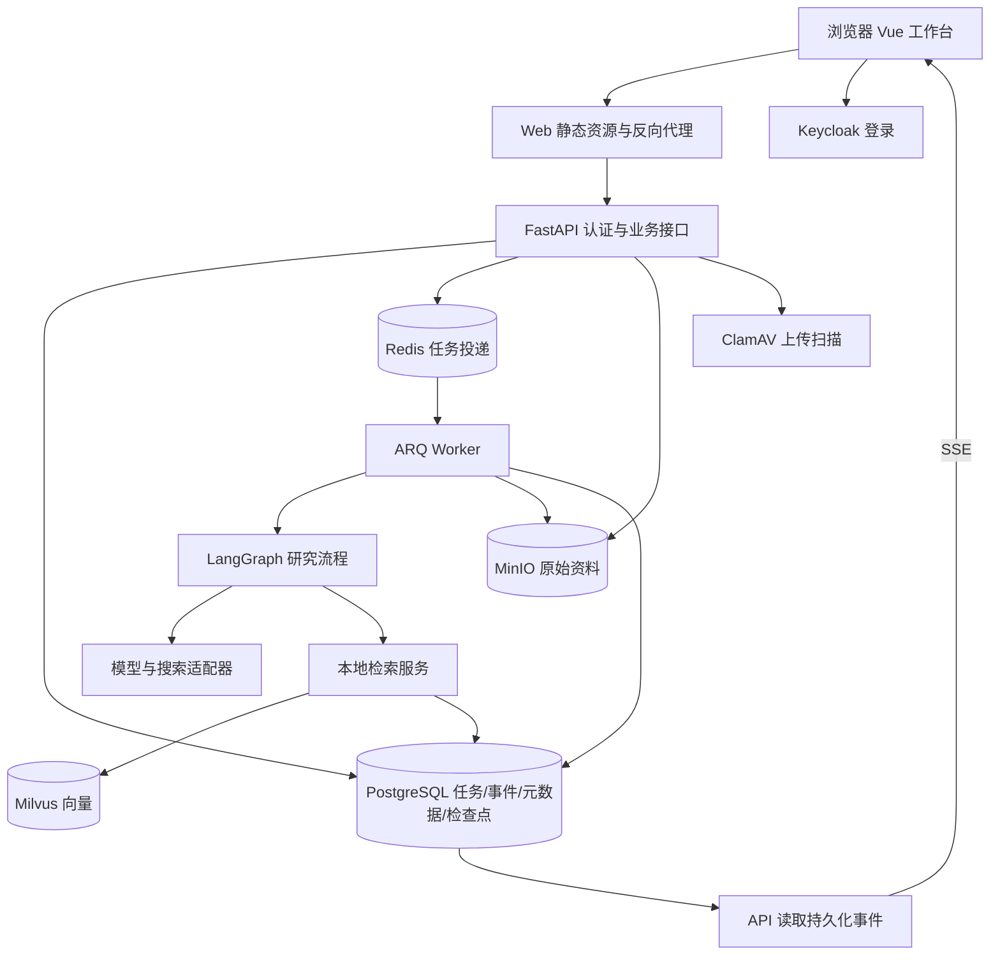
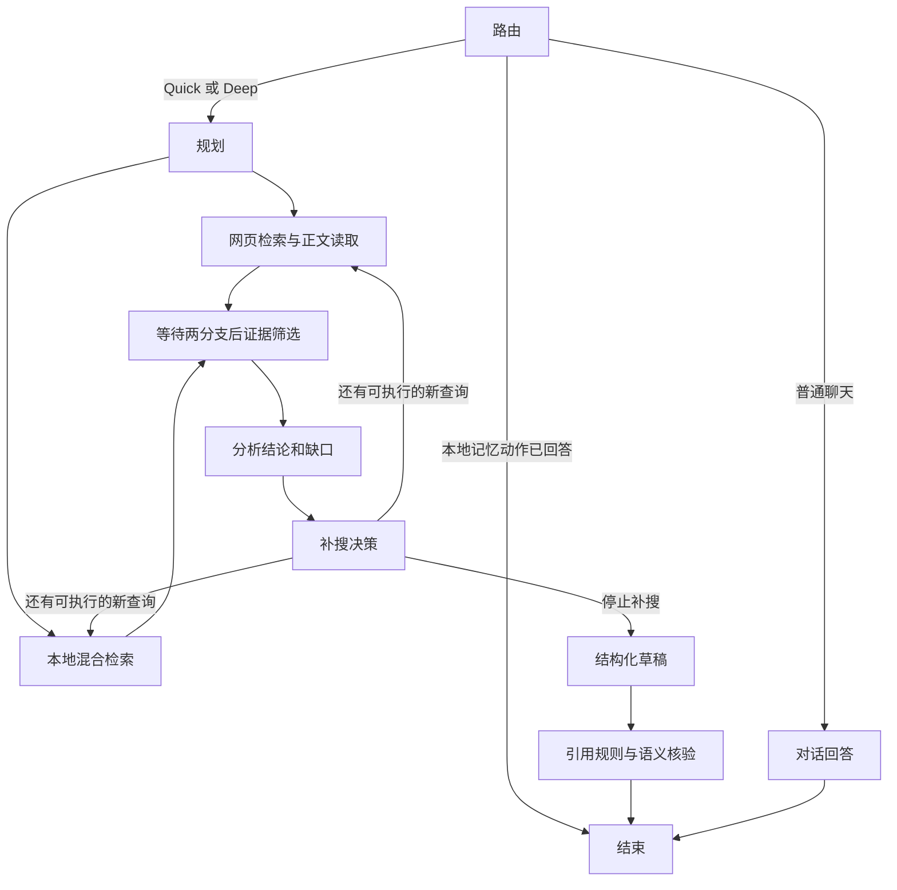

# DeepResearch 新手项目导学

阅读基线：2026-09-12，代码提交 `3afa0bec30694ed3f6741dfb0291ef68e449587a`。本文通过静态阅读当前源码、测试与配置编写；没有启动服务、调用项目模型或重新运行评测。历史结果引用的是仓库中 2026-09-11 的记录，不能当作今天的运行成绩。

本文和 [面经-深度研究.md](面经-深度研究.md) 配套使用。先理解一条请求如何完成，再理解每层为什么存在，最后练习面试表达。技术选择的“适用理由”是根据代码和需求做出的工程分析，不代表已经查证作者当时的真实决策过程；没有做过的方案对比实验不写成已做。

## 1. 前置知识（面试高频标注）

| 知识点 | 为何需要 | 在本项目中的位置 | 高频度 |
| --- | --- | --- | --- |
| HTTP、JSON、状态码 | 看懂提交任务、查询状态、错误返回；202 表示已接受，不表示报告完成 | `backend/api/app.py` | 极高 |
| Python 函数、类、异常、类型标注 | 看懂服务对象与结构化数据 | `backend/domain/models.py`、`backend/services/runtime.py` | 极高 |
| async/await、事件循环 | 等待网络时让其他请求继续；不等于自动开启多个 CPU 核心计算 | `backend/infrastructure/providers.py` | 极高 |
| 状态机、条件分支、并行汇合 | 研究不是一个固定提示词，而是有状态、有回路的流程 | `backend/research/graph.py` | 极高 |
| SQL、事务、唯一约束、条件更新 | 防重复提交、跨进程抢占和旧任务覆盖 | `backend/core/postgres.py`、`backend/core/db.py` | 极高 |
| LLM、提示词、结构化输出 | 模型生成受约束的数据，代码再校验并使用 | `backend/infrastructure/providers.py` | 极高 |
| RAG、Embedding、BM25 | 先找相关资料，再基于资料组织回答 | `backend/services/documents.py` | 极高 |
| 身份认证与资源授权 | 登录成功不代表能访问任意工作空间 | `backend/core/auth.py`、`backend/api/app.py` | 高 |
| 消息队列、幂等、检查点 | 接口与长任务分离，执行中断后有恢复依据 | `backend/worker.py`、`backend/services/runtime.py` | 高 |
| SSE、流式解析、重连游标 | 浏览器增量看到研究步骤 | `frontend/src/api.ts` | 高 |
| 缓存失效、最终一致性 | 数据修改后不能继续使用旧检索结果 | `backend/services/documents.py` | 高 |
| Docker Compose、指标、日志、Trace | 复现环境并定位任务慢在哪里 | `compose.yaml`、`backend/core/observability.py` | 中高 |

先把几个词翻译成人话：Embedding 是把文本转换成用于比较相似性的向量；Chunk 是可定位的资料片段；Evidence 是候选依据；Claim 是需要依据支持的一条结论；Checkpoint 是流程保存的进度；Worker 是处理后台任务的进程。

## 2. 重点亮点与学习顺序（先看这个）

| 亮点标题 | 为什么重要 | 通用技术关键词 | 先看哪些文件 | 建议学习顺序 |
| --- | --- | --- | --- | --- |
| 状态建模与研究编排 | 先知道系统在做什么，避免只背中间件名称 | 状态图、分支、汇合、有限循环 | `backend/domain/models.py`、`backend/research/graph.py` | 1 |
| 证据约束与结果校验 | 理解 AI 应用和直接调用模型的区别 | 引用、结构校验、语义核验、拒答 | `backend/research/evidence_policy.py`、`backend/research/graph.py` | 2 |
| 混合检索与数据生命周期 | 理解资料如何从文件变成可引用片段 | 切块、向量、关键词、缓存、版本 | `backend/services/documents.py`、`backend/infrastructure/vectors.py` | 3 |
| 长任务可靠性 | 理解为什么刷新页面后任务还能继续 | 持久化、队列、幂等、恢复 | `backend/services/runtime.py`、`backend/worker.py` | 4 |
| 身份与上下文隔离 | 理解“谁的数据”“哪次会话”的边界 | OIDC、RBAC、资源归属、记忆范围 | `backend/api/app.py`、`backend/core/auth.py` | 5 |
| 全链路观测与验证 | 把“应该正确”变成可检查的证据 | 单测、组件测试、质量门禁、Trace | `tests/`、`scripts/evaluate_research.py`、`observability/` | 6 |

建议第一遍只追一条深度研究请求：提交“比较两种知识库部署方式”→任务被接受→执行计划→查网页/资料→得到证据→生成并核验报告。第二遍再看失败、删除和恢复分支。

## 3. 必备知识点

- [ ] 能区分工作空间、账号、会话、一次研究任务、一次执行尝试。
- [ ] 能画出从浏览器到 Worker 再到最终报告的链路。
- [ ] 能解释数据模型、图节点、工具适配器和存储各自负责什么。
- [ ] 能说明多角色可以共享同一个模型端点，且并非每个角色都会调用模型。
- [ ] 能区别“检索到资料”“来源存在”“来源支持结论”这三个判断。
- [ ] 能说明重连事件、恢复图执行、重试模型请求是三件不同的事。
- [ ] 能说出一个当前实现的局限，并提出可验证的改进办法。
- [ ] 能给每项指标补充样本、时间、真实组件/替身和失败情况。

## 4. 推荐阅读（结合仓库）

时间是学习安排建议，不是完成承诺；新手可将每项拆成多次。

| 主题 | 通用技术点 | 建议阅读位置 | 预计时间 | 读完能回答什么 |
| --- | --- | --- | --- | --- |
| 产品入口 | 页面与能力边界 | `README.md`、`frontend/src/App.vue` | 40–60 分钟 | 用户能完成哪些动作？ |
| 数据字典 | 请求、计划、证据、结论 | `backend/domain/models.py` | 40–60 分钟 | 各步骤输入输出是什么？ |
| 一条研究链路 | 图、状态、条件边 | `backend/research/graph.py` | 90–150 分钟 | 为什么要补搜？何时结束？ |
| 角色约束 | 工具许可与事件 | `backend/research/agents.py`、`tests/test_agents.py` | 40–60 分钟 | 角色到底有什么区别？ |
| 报告可信度 | 规则与语义校验 | `backend/research/evidence_policy.py`、`tests/test_evidence.py` | 60–90 分钟 | 有来源为什么仍可能错？ |
| 请求执行 | 建任务、抢占、终态 | `backend/api/app.py`、`backend/services/runtime.py` | 90–150 分钟 | 202 后谁在执行？ |
| 文档 RAG | 切块、融合、缓存 | `backend/services/documents.py`、`backend/infrastructure/vectors.py` | 90–150 分钟 | 一份 PDF 如何进入回答？ |
| 一致性 | 版本与补偿 | `backend/core/consistency.py`、`tests/test_consistency.py` | 60–90 分钟 | 删除与索引并发会怎样？ |
| 身份和会话 | 登录、资源归属 | `frontend/src/auth.ts`、`backend/core/auth.py`、`tests/test_enterprise_access.py` | 60–90 分钟 | 改一个 ID 能否越权？ |
| 浏览器进度 | 帧解析和重连 | `frontend/src/api.ts`、`frontend/src/api.test.ts` | 40–60 分钟 | 断网后如何继续看进度？ |
| 部署和故障 | 多服务单机编排 | `compose.yaml`、`docs/operations.md`、`scripts/recovery.py` | 60–90 分钟 | 哪些服务要备份？ |
| 验证证据 | 固定集、实模、负载 | `scripts/evaluate_retrieval.py`、`scripts/evaluate_research.py`、`docs/resume-audit-20260911.md` | 60–90 分钟 | 指标能证明什么？ |

每读完一个文件，写下四句话：“入口是什么；读取什么；改变什么；失败怎么办”。不要第一天从头逐行读完整个运行服务。

## 5. 自学提醒

若某文件或原理看不懂，请继续追问 AI；本技能负责给学习路径与题目，不提供逐行讲解。

可以这样追问：“用一个请求示例解释研究图的分叉和汇合”“只解释任务恢复，不扩展到其他模块”“画出资料删除与正在索引之间的竞态”。学习时先用自己的话回答，再核对面经，避免只能复述术语。

## 6. 项目技术定位

**AI 应用后端为主，兼有前端、检索和运维工程。** 它面向中文研究任务，把模型调用组织成受证据约束的报告流程，配套资料库、工作空间、长任务恢复和过程可视化。没有训练基础模型，也不是分布式多模型智能体集群。

### 6.1 用户视角

用户登录后，在一个工作空间中创建连续会话；可上传资料，提出研究问题，查看步骤、来源和报告，取消或恢复研究，保存偏好和报告记忆。管理员另有成员、额度、死信恢复和数据管理入口。后端权限支持工作空间管理，当前页面主要使用返回的第一个工作空间，不宜宣传为已经完善的任意多工作空间切换产品。

### 6.2 系统地图



图中 Redis 管投递，PostgreSQL 管任务事实；Milvus 管向量候选，SQL 元数据决定资料当前是否有效；MinIO 保存原件。它们不是可以相互替代的四种缓存。

### 6.3 数据归属与几个容易混淆的 ID

| 概念 | 作用 | 当前实现注意点 |
| --- | --- | --- |
| 账号 subject | 谁发起操作、谁拥有私人偏好 | 从已验证 JWT 得到；对应个人记忆归属和任务创建者 |
| Workspace | 团队资料、研究和权限范围 | 很多旧命名 `user_id` 实际存的是工作空间 ID，要沿调用链判断 |
| Thread | 一段连续对话 | 可包含多次研究；对话历史受同一工作空间约束 |
| Run | 一次研究任务 | 关联问题、模式、状态、报告、来源、计数和事件 |
| attempt | 同一任务的执行版本 | 旧执行者不能覆盖新尝试的关键终态 |
| 图检查点的 thread_id | LangGraph 保存状态的命名空间 | 此处实际传入 Run ID，不是用户会话的 Thread ID |

主要 SQL 数据：`runs` 保存任务和报告；`events` 保存增量事件；`documents/chunks` 保存资料元数据及片段；`memories` 保存不同范围的记忆；`counters/workspace_daily_usage` 保存调用量；`dead_letter_runs` 保存失败处置记录；`document_cleanup` 保存待补偿清理项。表定义需结合 `backend/core/db.py`、`backend/core/postgres.py` 和 `migrations/versions/` 阅读。

## 7. 核心原理解析

### 7.1 从一次请求理解分层与图编排

**问题：** 研究很慢、步骤多，浏览器不能一直等一个普通响应。

**机制：** 前端提交问题和客户端请求编号；接口验证身份与角色，创建持久任务并返回 202；队列投递任务 ID；Worker 抢占成功后加载图状态并执行。图结束后写报告，浏览器通过事件流及查询接口获得结果。

**落点：** `frontend/src/App.vue` 的提交逻辑 → `backend/api/app.py` 的创建研究接口 → `backend/services/runtime.py` 的 `create/schedule/execute_run` → `backend/worker.py`。



Quick/Deep 共用研究骨架：Quick 在代码中限制为一条查询并跳过补搜；Deep 可按缺口补搜，受轮次和预算约束。规划提示词要求 Quick 只有一个子问题，但问题数量并未像查询数量那样在代码中强制截断。手动模式覆盖自动路由；自动模式由模型结合上下文决定。网页与本地分支并行；网页查询调用本身是循环顺序调用，候选网页正文读取才有并发控制，不能统称“所有检索完全并行”。

角色通过共享 `ResearchState` 交接。并行分支分别写 `web_results` 和 `local_results`，到裁决节点合并，不是两个分支无约束地改同一个列表。角色事件中的接收方来自静态候选映射，产物只记录字段名，不代表该次实际分支都执行，也不是完整交接正文。

### 7.2 从文件到证据理解 RAG

**问题：** 模型不了解新上传资料，长文件也不能全部塞进每次提示词。

**机制：** 校验文件 → 保存隔离原件 → 扫描 → 提取内容和定位 → 切块 → 计算向量 → 建立检索数据 → 标记可用。查询时结合字面匹配与语义匹配，只取少量相关片段进入研究图。

**落点：** `backend/services/documents.py`、`backend/infrastructure/vectors.py`、`backend/infrastructure/object_store.py`。

当前切块先按文档结构定位，再按句子和长度处理，约束为最多 1100 字符并保留 180 字符重叠；字符不是 Token。定位包含页码、段落或表格信息以及片段字符位置。图片经过视觉模型提取，扫描 PDF 只在可提取嵌入图像时尝试视觉处理，不是通用 OCR 版面引擎。

BM25 使用 `rank-bm25`，中文按单字、英文数字按连续词提取；没有接入中文语义分词器。向量索引使用余弦相似度。多个查询各自检索，对同一片段分别取最大的词法/向量分数，排序为：

```text
融合分数 = 0.65 × 非负向量分数 + 0.35 × 按当前查询最大值归一化的 BM25 分数
```

随后用词项集合 Jaccard 相似度过滤高度重复片段，阈值为 0.82。这是固定权重加去重，不是 RRF、交叉编码器重排，也不是完整 MMR 优化。两个最高分可能来自不同查询；当前实现并不证明权重是全局最优。

结果缓存键包含工作空间、可用资料的内容/版本指纹、查询列表和返回条数。BM25 语料另有进程内缓存。修改资料改变指纹，避免旧结果直接命中；不同进程会各自加载语料，不能称为统一共享内存索引。嵌入模型和维度有指纹校验，切换配置需要重建向量，不能混用。

注意：当前 `search` 中向量请求失败会让该次本地检索抛错，图层记录警告并使用其他来源；虽然计算过 BM25，也没有在这个异常路径独立返回纯 BM25 结果。

### 7.3 从一条结论理解可信回答

**问题：** 一个真实链接可能与结论无关；数字相同也可能主体、年份或否定方向不同。

**机制：** 先筛相关证据，再分析带来源的结论，再生成结构化草稿；确定性规则检查来源和重要数字，随后由模型只看该结论引用的片段判定支持关系。失败时最多修订一次，再校验，仅渲染被批准的结论。遗漏或重复的核验编号不能自动视为通过。

**落点：** `backend/research/graph.py` 的 `judge/analyst/writer/check_draft/validator` 和 `backend/research/evidence_policy.py`。

例子：“甲组完成任务”不能直接扩写成“甲组业务成功”。JSON 格式正确和来源编号有效都不能解决这个语义问题。模型核验是一道缓解措施，还会漏检。

重要边界：规则要求重要结论有正文或本地文档，同时要求两个网页域名或已配置可信标签。当前纯本地证据通常没有网页域名和可信标签，因此即使本地有数字原文，也可能被拒绝；不能写成“一个本地文档即可通过”。另外，两个域名不必然代表独立采编，全文可读也不代表真正的一手权威来源。

### 7.4 从断线与崩溃理解可靠性

**问题：** 网络重试可能重复提交，Worker 可能停止，旧执行者可能晚到。

**机制：** 工作空间内的客户端请求编号用于幂等，同编号不同内容返回冲突；数据库唯一约束限制同会话活跃任务。Worker 用条件更新抢占任务，执行版本用于保护报告终态、失败状态和心跳写入。队列未投递成功时保留已落库任务，由恢复循环重新投递。

**落点：** `backend/services/runtime.py`、`backend/core/postgres.py`、`tests/test_consistency.py`、`tests/test_research.py`。

心跳间隔常量为 10 秒，失活判断为 45 秒；恢复循环本身也有周期，之后还有排队和实际执行，因此不能推导出“45 秒内必定恢复”。检查点保存在 PostgreSQL，重启后根据同一 Run 的检查点继续；未完成的节点可能重新调用外部服务。

当前 ARQ 配置 `retry_jobs=False`，不要把 `max_tries` 的存在解释成所有失败会自动重试。任务失活恢复、人工恢复、模型网络层有限重试属于不同机制。失败任务进入 SQL 死信表，管理员发起恢复后仍要跟踪实际终态。

SSE 从 SQL 事件表按序号读取，前端用 Fetch 流解析并携带已见游标重连；它展示步骤，不是模型逐 Token 输出。事件重放不会重新调用研究图。尝试版本保护不等于所有事件、检查点和外部 API 副作用都有端到端 fencing，不能承诺 exactly-once。

### 7.5 从身份和不可信内容理解安全

**问题：** 浏览器传来的 ID 不可信，网页和文件中的命令也不可信。

**机制：** Keycloak 完成登录，前端授权码流程使用 PKCE；后端验证 JWT 后查询账号与工作空间的成员关系，再检查资源归属和角色。个人偏好按账号保存，会话历史按工作空间和 Thread 筛选，历史摘要仅用于上下文理解。

**落点：** `frontend/src/auth.ts`、`backend/core/auth.py`、`backend/api/app.py`、`backend/services/runtime.py`。

同一研究中的角色使用工具许可，当前协程角色通过 ContextVar 保存并在退出时恢复；仅在经过受控包装器且存在角色作用域时生效，不是 OS 沙箱。不可信资料被提示为数据，输出通过结构化与引用检查，但没有“完全消除提示注入”的证明。

网页抓取限制协议、端口、DNS 结果、跳转和体积，连接固定到验证后的地址并保留 Host/SNI，降低 DNS 重绑定风险；缓存命中不发起新网络请求，因此不会逐次重新抓取或重新验证 DNS，不能称每次命中都重新检查。前端 Markdown 经过 DOMPurify 清洗，避免把模型文本直接当可信 HTML。

成员关系在请求入口检查；已建立的 SSE 连接和正在执行的任务没有逐步骤撤权订阅。管理员修改成员权限后，新请求会重新鉴权，但“即时停止既有流和任务”不是现成能力。

### 7.6 从删除资料理解跨存储一致性

**问题：** PostgreSQL、Milvus、MinIO 之间没有一个覆盖全部写操作的数据库事务。

**机制：** 用 SQL 状态决定可检索性；文档删除先标记删除并推进版本、清除 SQL 片段，再异步补偿清理对象和向量。索引写回前核对状态和版本，避免旧索引任务把已删除文档重新变成可用；失败清理项保留，供后续重试。

**落点：** `backend/services/documents.py` 的 `ingest/delete/cleanup_pending`。

S3 模式的移动由复制和删除两步组成，不是跨对象原子 rename；本地文件替身才使用文件系统替换。仓库 README 的“原子移动”描述不应照搬到 MinIO。删除可见性、底层物理清理和已有并发查询的返回不是同一个时间点，当前实现不能承诺线性一致的全链路撤回。

## 8. 关键设计决策：为什么选择它，而不是另一个

以下先说明当前事实，再给适用理由、替代条件和验证办法；替代方案均未在本次做性能对照。

| 决策与备选 | 当前落点 | 取舍分析 | 风险与何时考虑替代 | 验证办法 |
| --- | --- | --- | --- | --- |
| Python + FastAPI；备选 Spring Boot、Django、Flask | 异步 API、Pydantic 模型、Python AI 组件 | 当前主要等待外部服务，Python 能直接组织图、解析与检索代码；FastAPI 便于接口校验和依赖注入 | 不是 Python 比 Java 一定快。已有 Java 团队可用 Java 做业务层、Python 做研究服务；CPU 重任务要另外安排 | 拆分 I/O、CPU 时间，比较开发成本和吞吐；[FastAPI 并发说明](https://fastapi.tiangolo.com/async/) |
| LangGraph；备选普通函数链、自由工具循环 | 显式分支、双路汇合、补搜回路、持久检查点 | 流程已有状态和循环，显式图有利于约束步骤及恢复；简单串行问答可直接函数调用 | 图本身不保证事实正确，也不自动实现外部副作用幂等 | 用相同任务比较调试、恢复与错误定位；[LangGraph 官方概览](https://docs.langchain.com/oss/python/langgraph/overview) |
| Pydantic + JSON 输出；备选自由文本解析 | 请求与模型结果校验 | 把字段、长度、枚举错误暴露在边界，方便后续代码消费 | 当前是 JSON object 模式加本地校验，不是服务端严格 schema 解码；格式正确仍可能事实错误 | 错枚举、缺字段、截断、尾逗号和空输出反例 |
| 多职责角色；备选一个模型提示词包办 | 角色作用域、不同工具许可、状态交接 | 更容易限制联网和写作职责，看到失败发生在哪一步 | 多次调用增加时延成本；共享模型存在相关错误；简单任务多角色可能过重 | 比较同题成本、证据支撑率和失败定位能力 |
| RAG；备选把全文塞入上下文、微调 | 文件切块和检索后提供证据 | 资料更新与来源追踪是核心需求；无需每次修改模型参数 | 召回遗漏、切块损失、抽取错误都会传导到答案；微调可用于行为风格，但不能代替实时证据链 | 标注相关片段和预期结论，分别测检索与答案 |
| Milvus；备选 pgvector、FAISS、Chroma | 独立向量服务、余弦检索、标量工作空间过滤 | 可把向量服务与事务库分开管理，练习独立组件接入和一致性治理 | 当前小语料没有证明必须用 Milvus。已有 PostgreSQL 时 pgvector 值得评估，可减少服务；本地原型也可选轻量方案 | 同语料比较过滤正确性、延迟、资源和维护成本；[Milvus 多租户](https://milvus.io/docs/multi_tenancy.md)、[pgvector 官方仓库](https://github.com/pgvector/pgvector) |
| BM25 + 向量；备选纯向量、纯关键词、RRF、模型重排 | 固定加权融合和去重 | 字面术语与语义近义互补，规则可解释、实现直接 | 分数不天然校准，中文单字切分较粗；不应说优于所有重排方案 | 同一冻结集做权重、分词和排序消融，扩大未见查询 |
| PostgreSQL；备选 SQLite、MySQL | 默认事务源、检查点、并发条件更新 | 当前有多个进程写入和持久恢复需求，且使用 PostgreSQL advisory lock 和检查点适配 | SQLite 留给隔离测试；MySQL 并非不可用，但需适配锁、SQL 和检查点 | 验证并发抢占、迁移与重启恢复，不能只测连接成功 |
| Redis + ARQ；备选接口内任务、Celery、专用工作流系统 | Python 异步 Worker 与投递队列 | 适合当前异步任务入口，进程退出后依赖持久任务记录恢复 | 仍需自己处理任务状态和补偿；复杂调度、组织已有基础设施时再评估替代 | 重复投递、投递失败、崩溃恢复；[ARQ 官方文档](https://arq-docs.helpmanual.io/) |
| SSE；备选轮询、WebSocket | Fetch 解析事件流，数据库游标重放 | 主要需求是服务端单向推送研究进度；取消另走 HTTP 接口 | 后端仍每隔一段时间查事件表，并非完全无轮询；大量连接需测 DB 和代理负载 | 断线重连、分片、中文编码、旧事件去重；[MDN SSE](https://developer.mozilla.org/en-US/docs/Web/API/Server-sent_events/Using_server-sent_events) |
| Keycloak OIDC；备选自建密码登录、托管身份服务 | 标准授权码流程，服务端 JWT 验证 | 将账号登录与业务资源授权分开，可在单机演示完整认证链 | 自托管增加运维；浏览器存储令牌仍需重视 XSS；撤权不是现有连接即时生效 | 过期、伪造、错受众、跨空间、viewer 写入用例 |
| MinIO + ClamAV；备选本地磁盘、外部对象存储与扫描 | 原件隔离、扫描、索引状态门控 | 原件与处理进程分离；未确认安全的内容不能直接索引 | 扫描不解决提示注入；扫描失败会阻断上传；对象与 SQL 无共同事务 | 扫描不可用、恶意样本、复制失败、删除补偿 |
| Vue + TypeScript + Vite；备选 React、服务端模板 | 响应式研究页、来源面板、资料管理 | 当前交互可用响应式状态组织；类型检查帮助约束接口 | 不能由源码推断 Vue 性能胜过 React；当前大页面文件继续增长会难维护 | 页面切换、陈旧响应、防 XSS、构建类型检查 |
| Compose + OTel/Prometheus/Grafana；备选 Kubernetes、只打日志 | 单机多服务、指标/Trace/日志 | 复现整条依赖链，分开观察耗时和失败 | 服务多、资源占用高；单机仍是故障域；没有多副本 SLA 证据 | 健康检查、单机故障演练、备份恢复；规模增长后再评估编排升级 |
| 可配置模型与搜索适配；备选硬编码供应商 | 模型、嵌入、搜索配置与统一适配器 | 让调用接口和业务图分离，搜索支持主备回退 | 未做同题同预算供应商全面对比，不能宣称某模型最优；切换模型需重验结构化输出和质量 | 对比可靠来源比例、费用、时延、否定/数值题；当前真实运行配置本次未读取 |

面试回答选型的顺序：**业务约束 → 当前技术解决哪一层问题 → 付出的代价 → 替代方案何时更合适 → 用什么验证。** 不要回答“因为流行”“性能最好”“大厂都用”。

## 9. 量化与验证（含待测，建议）

### 9.1 仓库已有证据：历史记录，本次未重跑

| 证据 | 历史结果 | 正确解释 |
| --- | --- | --- |
| 固定资料检索 | 14 份资料、16 个标注问题，Recall@5：0.9688 → 1.0000；nDCG@5：0.9446 → 0.9676 | 固定集上单向量与混合检索对照，不是通用准确率 |
| 完整研究质量 | 29/30；引用支持 294/295，即 99.66%；覆盖率 100% | 关键题失败，整体门禁不通过；图外同模型评分不是人工盲评 |
| 回归检查 | 后端 108 通过、4 组件测试另行通过；前端 4 通过 | 2026-09-11 的记录；测试通过不等于回答都正确 |
| 业务负载 | 5 客户端、300 秒、4576 请求、386/386 接受任务完成 | 外部模型/搜索/嵌入使用可控替身，存储组件真实；不是实模吞吐 |
| Worker 故障演练 | 53.50 秒恢复 | 单机单次观察，不是 RTO/SLA |

证据文件：[审计解释](docs/resume-audit-20260911.md)、[脱敏结果](eval/audit-20260911.json)、[检索结果](eval/benchmark_results.md)。本次阅读确认这些文件记录如此，没有据此宣称当前线上或容器仍是同样状态。

### 9.2 建议如何验证自己是否理解

1. **纸面追踪，不必先运行：** 选一个深度研究问题，列出每个节点输入与输出；用例子解释为何网络和本地结果不会覆盖彼此。
2. **读反例测试：** 从 `tests/test_agents.py`、`tests/test_consistency.py`、`tests/test_evidence.py` 各选一题，先预测错误实现会怎样，再看断言约束什么。
3. **准备好隔离环境后再验证：** 单测使用新的临时数据目录；真实组件使用独立环境；外部模型评测需要密钥并会产生调用成本。不要把历史 `.cache` 文件当新结果。
4. **对指标分层：** 检索测相关资料是否找到；答案测引用支持和预期事实覆盖；系统测任务状态、重复终态、恢复和延迟。三层分别报告。
5. **记录待测项：** 扩大的未见中文查询集、真实模型并发成本、Milvus 与 pgvector 对照、人工盲评一致性、长连接撤权、向量故障纯 BM25 降级均待测或待实现。

新手自测：能不看文档讲清“一个请求、一个文件、一次断线、一次 Worker 崩溃、一次越权请求”就完成了第一轮整体理解；不要求先背完所有中间件配置。
