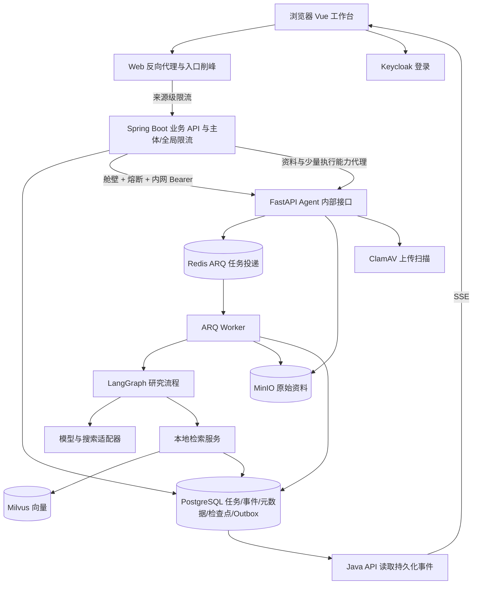
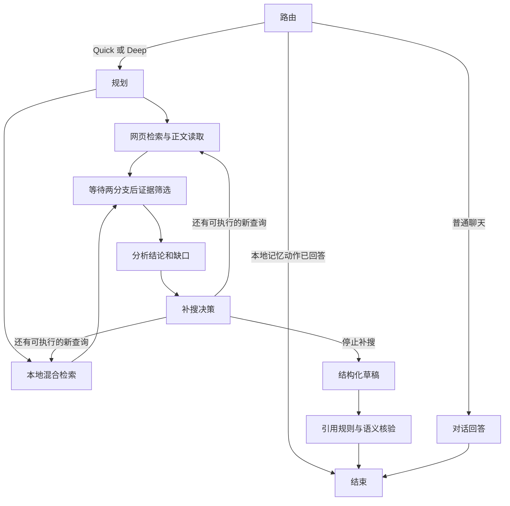
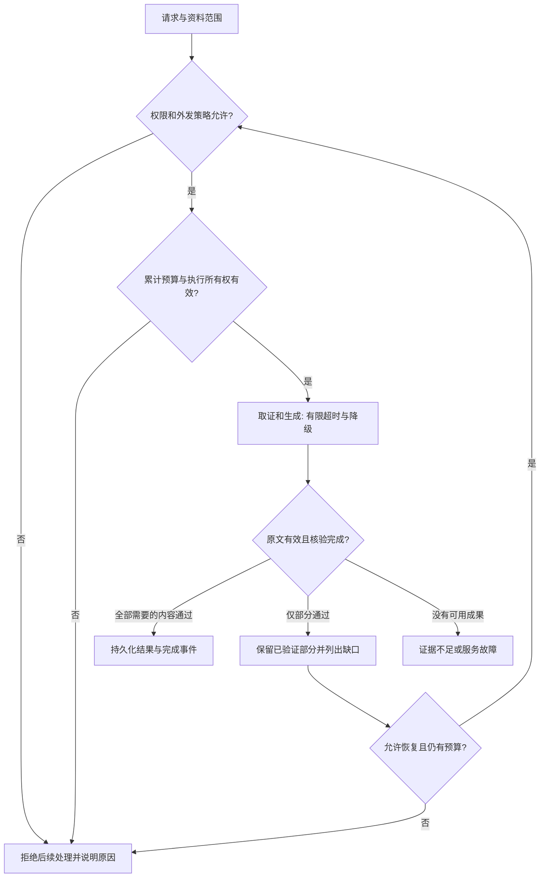

# DeepResearch 新手项目导学

阅读基线：2026-09-29，在 `62c163cbb32ea5c67d92217a98a11a4e6a0b089c` 基础上复测当前工作区；最终发布版本以本次 Git 提交为准。项目保持 **Java 21 + Spring Boot 3.5 业务控制面、Python Agent 执行层** 主线；Docker 数据库迁移为 `0012_report_publication`。Java 管理报告审核与发布，Python 保留混合检索、版本化资料索引和研究执行。本轮补充真实浏览器功能与人工界面检查、隔离并发测试，并保留真实模型结构化输出波动记录。固定 30 题上轮本地为 29/30、整体门禁通过，`compare-1` 仍失败；更早一次远端门禁重跑 30/30 不能抹掉首次失败。各项结果都须连同源码版本、测试环境和失败样本解释，不能混为通用准确率、生产吞吐或 SLA。

本文和 [面经-深度研究.md](面经-深度研究.md) 配套使用。先理解一条请求如何完成，再理解每层为什么存在，最后练习面试表达。技术选择的“适用理由”是根据代码和需求做出的工程分析，不代表已经查证作者当时的真实决策过程；没有做过的方案对比实验不写成已做。

交付复核补充：首次提交 `774b96e` 的 CI 暴露了 Quay 上固定 MinIO 镜像拉取失败，以及真实模型在否定关系和版本替代题中扩写无依据结论。当前改用官方同版本发布文件加 SHA-256 校验构建 MinIO，隔离组件 4/4 通过；证据门控补充“主体关系未知不可冒充原文事实”和“原文已明确替代不可反说待确认”。这是对具体失败的修复，真实模型稳定性仍须看完整固定题集和独立人工评审。

## 0. 三分钟先把项目看懂

如果把普通搜索比作“问一个人一个问题”，DeepResearch 更像一间小型研究室：

- **Java 是前台、调度员和账房。** 它确认来访者是谁、能看哪些资料、能否再开一个任务，并把接单、取消、报告送审、批准及撤回记入业务账本。
- **Python Agent 是研究团队。** 它拆问题、查网页和内部资料、分析冲突、生成报告，再逐条检查结论有没有原文支持。
- **PostgreSQL 是共同事实账本。** 任务、事件、命令和检查点都能在进程重启后继续查到；Redis 负责叫醒 Worker，不是最终事实源。
- **限流、舱壁和熔断像消防门。** 上游模型或 Agent 变慢时，系统宁可快速拒绝一部分新请求，也不让一个慢请求占住所有线程，把登录、查询历史等正常功能一起拖死。
- **页面上的资料范围是执行策略。** 公开资料与内部资料模式有不同取证和上下文边界；首页文案应跟随当前策略，不能暗示会把两类资料同时发送或检索。

只记一句话：**Java 管“谁能做、能不能做、报告能否交付”，Python 管“怎样检索、分析和写报告”；证据核验是送审门槛，正式发布还要由另一位管理员审核。**

第一次阅读只回答四个问题：用户提交后谁先接单？命令怎样不丢？慢上游怎样被隔离？最终结论怎样回到原文？能答清这四个问题，再进入具体框架和类名。

## 1. 前置知识（面试高频标注）

| 知识点 | 为何需要 | 在本项目中的位置 | 高频度 |
| --- | --- | --- | --- |
| HTTP、JSON、状态码 | 看懂提交任务、查询状态、错误返回；202 表示业务侧已接受，不表示 Agent 已完成报告 | `business-backend/src/main/java/com/deepresearch/business/api/` | 极高 |
| Java、Spring MVC、JDBC、事务 | 看懂公开业务 API、OIDC、工作空间授权、研究准入及 Outbox 同事务写入 | `business-backend/src/main/java/com/deepresearch/business/` | 极高 |
| Python 函数、异步与类型标注 | 看懂 Agent 图、模型/检索适配、文档处理和 Worker 执行 | `backend/domain/models.py`、`backend/services/runtime.py` | 极高 |
| async/await、事件循环 | 等待网络时让其他请求继续；不等于自动开启多个 CPU 核心计算 | `backend/infrastructure/providers.py` | 极高 |
| 状态机、条件分支、并行汇合 | 研究不是一个固定提示词，而是有状态、有回路的流程 | `backend/research/graph.py` | 极高 |
| SQL、事务、Outbox、条件更新 | 防重复提交，让任务状态和待投递命令一起提交，并阻止旧执行覆盖新尝试 | `business-backend/src/main/java/com/deepresearch/business/service/ResearchCommandService.java`、`business-backend/src/main/java/com/deepresearch/business/service/OutboxService.java`、`backend/core/postgres.py` | 极高 |
| LLM、提示词、结构化输出 | 模型生成受约束的数据，代码再校验并使用 | `backend/infrastructure/providers.py` | 极高 |
| RAG、Embedding、BM25 | 先找相关资料，再基于资料组织回答 | `backend/services/documents.py` | 极高 |
| 身份认证与资源授权 | 登录成功不代表能访问任意工作空间；公开 API 与内部服务令牌是两条不同信任边界 | `business-backend/src/main/java/com/deepresearch/business/config/SecurityConfig.java`、`business-backend/src/main/java/com/deepresearch/business/security/WorkspaceAccess.java` | 高 |
| 消息队列、幂等、检查点 | 接口与长任务分离，执行中断后有恢复依据 | `backend/worker.py`、`backend/services/runtime.py` | 高 |
| SSE、流式解析、重连游标 | Java 从 PostgreSQL 重放持久事件，浏览器按事件 ID 去重续传 | `business-backend/src/main/java/com/deepresearch/business/api/ResearchController.java`、`frontend/src/api.ts` | 高 |
| 缓存失效、最终一致性 | 数据修改后不能继续使用旧检索结果 | `backend/services/documents.py` | 高 |
| Docker Compose、指标、日志、Trace | 复现环境并定位任务慢在哪里 | `compose.yaml`、`backend/core/observability.py` | 中高 |

先把几个词翻译成人话：Embedding 是把文本转换成用于比较相似性的向量；Chunk 是可定位的资料片段；Evidence 是候选依据；Claim 是需要依据支持的一条结论；Checkpoint 是流程保存的进度；Worker 是处理后台任务的进程。

## 2. 重点亮点与学习顺序（先看这个）

| 亮点标题 | 为什么重要 | 通用技术关键词 | 先看哪些文件 | 建议学习顺序 |
| --- | --- | --- | --- | --- |
| 业务与 Agent 分层 | 先看清 Java 和 Python 各自负责什么，避免把项目讲成 Java 转发壳或 FastAPI 单体 | 领域边界、OIDC/RBAC、内部 API、共享数据库、渐进式拆分 | `README.md`、`docs/java-python-ownership.md`、`business-backend/`、`backend/api/app.py` | 1 |
| 报告审核与交付 | 区分模型完成、核验完整、人工批准和成员可见四个时点 | 冻结快照、状态机、异人审核、审计、旧接口防泄露 | `ReportPublicationService.java`、`ReportPublicationController.java`、`0012_report_publication.py` | 2 |
| 事务命令投递 | 理解 202 之后命令怎样被原子认领、崩溃回收、退避和转入死信 | 幂等、事务 Outbox、`SKIP LOCKED`、租约、死信 | `business-backend/src/main/java/com/deepresearch/business/service/ResearchCommandService.java`、`business-backend/src/main/java/com/deepresearch/business/service/OutboxService.java`、`migrations/versions/0010_outbox_leases.py` | 2 |
| 状态建模与研究编排 | 理解 Python Agent 如何执行研究，而不是只背服务拆分 | 状态图、分支、汇合、有限循环 | `backend/domain/models.py`、`backend/research/graph.py` | 3 |
| 证据约束与混合检索 | 理解 AI 应用和直接调用模型的区别 | 引用、语义核验、拒答、向量与关键词融合 | `backend/research/evidence_policy.py`、`backend/services/documents.py` | 4 |
| 长任务可靠性 | 理解恢复、写入围栏和多进程冷启动分别解决什么 | 持久预算、执行围栏、advisory lock、有限恢复 | `backend/core/reliability.py`、`backend/core/checkpoints.py`、`backend/services/runtime.py` | 5 |
| 过载保护与定位 | 理解高峰期为何要先快速拒绝，以及怎样从日志和指标判断是谁先饱和 | 入口削峰、主体令牌桶、全局并发、代理舱壁、熔断、Trace | `frontend/nginx.conf`、`business-backend/src/main/java/com/deepresearch/business/security/ApiRateLimitFilter.java`、`business-backend/src/main/java/com/deepresearch/business/service/AgentClient.java`、`docs/performance-resilience-20260918.md` | 6 |
| 验证能力边界 | 分清单测、真实浏览器、真实模型与隔离负载能证明什么 | 测试分层、结构化输出、过载拒绝、人工体验 | `docs/functional-concurrency-verification-20260929.md`、`frontend/e2e/enterprise.e2e.ts`、`tests/test_providers.py` | 7 |

建议第一遍只追一条深度研究请求：提交“比较两种知识库部署方式”→任务被接受→执行计划→查网页/资料→得到证据→生成并核验报告。第二遍再看失败、删除和恢复分支。

本次增量阅读先按 7.1（Java 受理到 Python 执行）→7.4（调用、过载与恢复）→8（为什么这样选）→7.2/7.3（检索与核验）→9（证据）学习。对应面经先练 Q01、Q03、Q13–Q16，再练 Q21–Q25 和 F1–F4。

面试表达不要把所有题机械套成同一模板。开放设计题可按“需求分析 → 技术方案 → 核心流程 → 异常处理 → 优化方向”；故障题先说影响和错误分类，再讲止损、恢复、根因修复与验证；原理/选型题先给结论，再讲项目落点、取舍和边界。三种题型都必须区分当前实现、历史测量与未来计划。

## 3. 必备知识点

- [ ] 能区分工作空间、账号、会话、一次研究任务、一次执行尝试。
- [ ] 能画出从浏览器到 Worker 再到最终报告的链路。
- [ ] 能说明 Java 公开业务边界、Python Agent 边界，以及为什么这还不是完全数据库隔离的微服务。
- [ ] 能解释“事务内写任务与 Outbox”解决了什么，以及 `SKIP LOCKED`、过期租约、下游幂等为什么仍不能组成 exactly-once。
- [ ] 能解释数据模型、图节点、工具适配器和存储各自负责什么。
- [ ] 能说明多角色可以共享同一个模型端点，且并非每个角色都会调用模型。
- [ ] 能区别“检索到资料”“来源存在”“来源支持结论”这三个判断。
- [ ] 能说明重连事件、恢复图执行、重试模型请求是三件不同的事。
- [ ] 能说明入口限流、Java 全局并发、Agent 代理舱壁和供应商熔断分别保护哪一层。
- [ ] 能根据 `bulkhead_reject`、`circuit_open`、`global_rate` 和连接池指标判断慢请求先卡在哪里。
- [ ] 能说出一个当前实现的局限，并提出可验证的改进办法。
- [ ] 能给每项指标补充样本、时间、真实组件/替身和失败情况。

## 4. 推荐阅读（结合仓库）

时间是学习安排建议，不是完成承诺；新手可将每项拆成多次。

| 主题 | 通用技术点 | 建议阅读位置 | 预计时间 | 读完能回答什么 |
| --- | --- | --- | --- | --- |
| 产品入口 | 页面与能力边界 | `README.md`、`frontend/src/App.vue` | 40–60 分钟 | 用户能完成哪些动作？ |
| 数据字典 | 请求、计划、证据、结论 | `backend/domain/models.py` | 40–60 分钟 | 各步骤输入输出是什么？ |
| 一条研究链路 | 图、状态、条件边 | `backend/research/graph.py` | 90–150 分钟 | 为什么要补搜？何时结束？ |
| 角色约束 | 工具许可与事件 | `backend/research/agents.py`、`tests/test_agents.py` | 40–60 分钟 | 角色到底有什么区别？ |
| 报告可信度 | 规则与语义校验 | `backend/research/evidence_policy.py`、`tests/test_evidence.py` | 60–90 分钟 | 有来源为什么仍可能错？ |
| 公开业务入口 | OIDC、工作空间授权、研究准入、幂等、SSE | `business-backend/src/main/java/com/deepresearch/business/api/`、`business-backend/src/main/java/com/deepresearch/business/security/` | 90–150 分钟 | 哪些业务由 Java 直接处理？ |
| 命令可靠投递 | 事务 Outbox、租约、退避、死信、内部服务认证 | `business-backend/src/main/java/com/deepresearch/business/service/ResearchCommandService.java`、`business-backend/src/main/java/com/deepresearch/business/service/OutboxService.java`、`migrations/versions/0010_outbox_leases.py`、`backend/api/app.py` | 60–90 分钟 | 202 后命令怎样被认领、回收并抵达 Agent？ |
| 高峰流量与慢上游 | 入口削峰、认证后限流、并发舱壁、熔断、流式上传 | `frontend/nginx.conf`、`business-backend/src/main/java/com/deepresearch/business/security/ApiRateLimitFilter.java`、`business-backend/src/main/java/com/deepresearch/business/service/AgentClient.java`、`observability/alerts.yml` | 60–90 分钟 | 为什么一个 30 秒慢请求不会占满整个 Java 服务？ |
| Agent 执行 | 抢占、检查点、终态 | `backend/api/app.py`、`backend/services/runtime.py`、`backend/worker.py` | 90–150 分钟 | Python 如何调度并执行研究？ |
| 文档 RAG | 切块、融合、缓存 | `backend/services/documents.py`、`backend/infrastructure/vectors.py` | 90–150 分钟 | 一份 PDF 如何进入回答？ |
| 一致性 | 版本与补偿 | `backend/core/consistency.py`、`tests/test_consistency.py` | 60–90 分钟 | 删除与索引并发会怎样？ |
| 身份和会话 | 登录、资源归属 | `frontend/src/auth.ts`、`business-backend/src/main/java/com/deepresearch/business/security/WorkspaceAccess.java`、`tests/test_enterprise_access.py` | 60–90 分钟 | 改一个 ID 能否越权？ |
| 浏览器进度 | 帧解析和重连 | `frontend/src/api.ts`、`frontend/src/api.test.ts` | 40–60 分钟 | 断网后如何继续看进度？ |
| 部署和故障 | 多服务单机编排 | `compose.yaml`、`docs/operations.md`、`scripts/recovery.py` | 60–90 分钟 | 哪些服务要备份？ |
| 验证证据 | 固定集、实模、固定到达率负载、故障注入 | `scripts/evaluate_retrieval.py`、`scripts/evaluate_research.py`、`scripts/load_system_performance.py`、`scripts/load-system-k6.js`、`docs/performance-resilience-20260918.md` | 60–90 分钟 | 指标能证明什么，哪个模块会先保护性拒绝？ |
| 用户视角验收 | 数据范围文案、移动导航、权限提示、下载 | `frontend/src/App.vue`、`frontend/e2e/enterprise.e2e.ts`、`docs/functional-concurrency-verification-20260929.md` | 40–60 分钟 | 页面是否准确表达当前策略；E2E 与人工检查各覆盖什么？ |
| 试用证据 | 冻结题集、盲评、人工/Agent 同题对照 | `docs/agent-pilot-evidence.md`、`scripts/pilot_evidence.py`、`eval/research_quality_extensions.json` | 60–90 分钟 | 已有工具如何使用，哪些真实业务收益仍未验证？ |

每读完一个文件，写下四句话：“入口是什么；读取什么；改变什么；失败怎么办”。不要第一天从头逐行读完整个运行服务。

## 5. 自学提醒

若某文件或原理看不懂，请继续追问 AI；本技能负责给学习路径与题目，不提供逐行讲解。

可以这样追问：“用一个请求示例解释研究图的分叉和汇合”“只解释任务恢复，不扩展到其他模块”“画出资料删除与正在索引之间的竞态”。学习时先用自己的话回答，再核对面经，避免只能复述术语。

## 6. 项目技术定位

**Java/Python 混合的 AI 应用后端为主，兼有前端、检索和运维工程。** Java 业务后端负责公开 API、OIDC、工作空间资源、研究准入和生命周期；Python Agent 层负责 LangGraph、RAG、模型/搜索、文档解析和 Worker。它没有训练基础模型，也不是分布式多模型智能体集群；两个服务在当前渐进式拆分阶段仍共享 PostgreSQL。

**简历技术栈建议压缩为：** `Java / Spring Boot、Python / LangGraph、PostgreSQL、Milvus`。FastAPI、Redis、Vue、Docker、BM25、Reranker、OIDC 等不是删除，而是放到对应项目要点和追问里说明用途；全部平铺会让技术栈像组件清单，反而弱化“Java 业务控制面 + Python Agent + RAG”的主线。

### 6.1 用户视角

用户登录后，在一个工作空间中创建连续会话；可上传资料，提出研究问题，查看步骤、来源和报告，取消或恢复研究，保存偏好和报告记忆。管理员在工作台设置页可查看成员、按另一位用户复制的账号 ID 添加成员并设为审核管理员，也可移除不再需要访问的成员；移除留下审计，已有报告和任务继续保留。成员刷新工作空间列表后可切换到共享空间；这仍是账号 ID 加入流程，并非邮件邀请或自动审批邀请。

### 6.2 系统地图


```mermaid
flowchart TD
    U[浏览器 Vue 工作台] --> W[Web 反向代理与入口削峰]
    U --> K[Keycloak 登录]
    W -->|来源级限流| B[Spring Boot 业务 API 与主体/全局限流]
    B --> P[(PostgreSQL 任务/事件/元数据/检查点/Outbox)]
    B -->|舱壁 + 熔断 + 内网 Bearer| A[FastAPI Agent 内部接口]
    B -->|资料与少量执行能力代理| A
    A --> Q[(Redis ARQ 任务投递)]
    Q --> R[ARQ Worker]
    R --> G[LangGraph 研究流程]
    G --> L[模型与搜索适配器]
    G --> D[本地检索服务]
    D --> V[(Milvus 向量)]
    D --> P
    A --> O[(MinIO 原始资料)]
    A --> C[ClamAV 上传扫描]
    R --> O
    R --> P
    P --> E[Java API 读取持久化事件]
    E -->|SSE| U
```

图中浏览器只访问 Java 公开 API；Python Agent 不直接暴露给宿主机。Nginx 先做粗粒度来源削峰，Java 在认证后按主体和全局容量限流，再用独立舱壁与熔断保护 Agent 代理。Java 在一个数据库事务中写任务状态和 Outbox，调度器通过行锁跳过已被认领的命令、设置过期租约，再调用 Python 内部接口；Python 通过 Redis 投递 ARQ 作业。PostgreSQL 仍是双方共享的事实源，Milvus 管向量候选，MinIO 保存原件；这不是数据库已经按服务完全拆开的独立微服务架构。

### 6.3 数据归属与几个容易混淆的 ID

| 概念 | 作用 | 当前实现注意点 |
| --- | --- | --- |
| 账号 subject | 谁发起操作、谁拥有私人偏好 | 从已验证 JWT 得到；对应个人记忆归属和任务创建者 |
| Workspace | 团队资料、研究和权限范围 | 很多旧命名 `user_id` 实际存的是工作空间 ID，要沿调用链判断 |
| Thread | 一段连续对话 | 可包含多次研究；对话历史受同一工作空间约束 |
| Run | 一次研究任务 | 关联问题、模式、状态、报告、来源、计数和事件 |
| attempt | 同一任务的执行版本 | 旧执行者不能覆盖新尝试的关键终态 |
| 图检查点的 thread_id | LangGraph 保存状态的命名空间 | 此处实际传入 Run ID，不是用户会话的 Thread ID |

`business_outbox` 保存 Java 已提交但尚待 Agent 接收的调度、恢复与取消命令；在 `0010` 中增加处理状态、租约所有者、租约到期、最后错误和交付时间，可回收崩溃实例留下的命令。`provider_health` 保存 Python 供应商熔断，`call_attempts` 保存尝试账本，`verified_claims` 保存分批核验成果，任务行保存累计预算。主要 SQL 数据：`runs` 保存任务和报告；`report_publications` 保存 Java 管理的审核与冻结快照；`events` 保存增量事件；`documents/chunks` 保存资料元数据及片段，`0011` 为文档增加当前/待发布对象与名称、Hash 和更新时间；`memories` 保存不同范围的记忆；`counters/workspace_daily_usage` 保存调用量；`dead_letter_runs` 保存失败处置记录；`document_cleanup` 保存待补偿清理的版本与对象键。表定义需结合 `migrations/versions/0009_java_business_outbox.py`、`migrations/versions/0010_outbox_leases.py`、`migrations/versions/0011_document_hot_update.py`、`migrations/versions/0012_report_publication.py` 和两个服务的实现阅读。

## 7. 核心原理解析

### 7.1 从一次请求理解分层与图编排

**问题：** 研究很慢、步骤多，浏览器不能一直等一个普通响应。

**机制：** 前端把问题和客户端请求编号提交到 Java。Java 校验 JWT、工作空间角色、数据策略、队列/并发上限、附件归属和幂等重放，在同一 PostgreSQL 事务中创建任务、初始事件与 Outbox 命令后返回 202。调度器从 Outbox 取命令，通过 Docker 内网的独立 Bearer 凭证调用 Python Agent；Agent 再把固定任务编号投递到 Redis，Worker 抢占后加载检查点并执行研究图。Java 从持久事件表用 SSE 重放进度并提供报告查询。

**落点：** `frontend/src/App.vue` → `business-backend/src/main/java/com/deepresearch/business/api/ResearchController.java` → `business-backend/src/main/java/com/deepresearch/business/service/ResearchCommandService.java` 与 `business-backend/src/main/java/com/deepresearch/business/service/OutboxService.java` → `backend/api/app.py` 的内部 Agent 接口 → `backend/services/runtime.py` 的 `schedule/execute_run` → `backend/worker.py`。

这条链路要区分三种“成功”：数据库事务提交表示业务侧已接受；内部 Agent 返回成功表示命令已接收或已幂等处理；研究进入 `completed` 或 `insufficient` 才是业务终态。Outbox 让“任务行已提交但同步 HTTP 恰好失败”不至于永久丢命令。当前调度器使用 `FOR UPDATE SKIP LOCKED` 原子认领，网络调用期间持有有期限的租约，实例崩溃后其他实例可回收；暂时错误退避，永久错误或重试耗尽进入死信并支持受权限保护的人工重投。它仍依赖 Agent/Redis 的幂等任务编号承受“上游已执行但响应丢失”的重复投递，因此不能宣称端到端恰好一次。


```mermaid
flowchart TD
    S[路由] -->|普通聊天| C[对话回答]
    S -->|本地记忆动作已回答| E[结束]
    S -->|Quick 或 Deep| P[规划]
    P --> W[网页检索与正文读取]
    P --> L[本地混合检索]
    W --> J[等待两分支后证据筛选]
    L --> J
    J --> A[分析结论和缺口]
    A --> F[补搜决策]
    F -->|还有可执行的新查询| W
    F -->|还有可执行的新查询| L
    F -->|停止补搜| D[结构化草稿]
    D --> V[引用规则与语义核验]
    V --> E
    C --> E
```

Quick/Deep 共用研究骨架：Quick 在代码中限制为一条查询并跳过补搜；Deep 可按缺口补搜，受轮次和预算约束。规划提示词要求 Quick 只有一个子问题，但问题数量并未像查询数量那样在代码中强制截断。手动模式覆盖自动路由；自动模式由模型结合上下文决定。图结构保留网页与本地分支，实际取证受资料范围限制：公开范围不读取内部资料，内部范围不做公开搜索。同一 Worker 的网页搜索与正文读取分别有并发上限，默认 3 和 6；查询和候选做去重、轮转分配，并非无限并发。

角色通过共享 `ResearchState` 交接。并行分支分别写 `web_results` 和 `local_results`，到裁决节点合并，不是两个分支无约束地改同一个列表。角色事件中的接收方来自静态候选映射，产物只记录字段名，不代表该次实际分支都执行，也不是完整交接正文。

### 7.2 从文件到证据理解 RAG

**问题：** 模型不了解新上传资料，长文件也不能全部塞进每次提示词。

**机制：** 校验文件 → 保存隔离原件 → 扫描 → 提取内容和定位 → 切块 → 计算向量 → 建立检索数据 → 标记可用。查询时结合字面匹配与语义匹配，只取少量相关片段进入研究图。

**落点：** `backend/services/documents.py`、`backend/infrastructure/vectors.py`、`backend/infrastructure/object_store.py`。

当前切块先按文档结构定位，再按句子和长度处理，约束为最多 1100 字符并保留 180 字符重叠；字符不是 Token。定位包含页码、段落或表格信息以及片段字符位置。图片可经视觉模型提取；扫描、图形或疑似双栏 PDF 可渲染整页供视觉处理，DOCX 按正文顺序处理文字、表格与嵌入图片。视觉处理受内部资料外发开关限制，不是保证任意复杂版面无损还原的通用 OCR。

BM25 使用 `rank-bm25`，中文按单字、英文数字按连续词提取；没有接入中文语义分词器。向量索引使用余弦相似度。多个查询各自检索，对同一片段分别取最大的词法/向量分数，先形成融合候选：

```text
融合分数 = 0.65 × 非负向量分数 + 0.35 × 按当前查询最大值归一化的 BM25 分数
```

随后用词项集合 Jaccard 相似度过滤高度重复片段，阈值为 0.82。启用 Reranker 时，最多取 20 个去重候选，使用用户原始问题调用独立 HTTP 重排服务，研究链最终保留 6 个片段。`score/vector_score/bm25_score` 仍表示融合阶段结果，`rerank_score` 与 `ranking_stage` 单独说明是否实际完成重排；这不是用另一个 Embedding 模型重新向量化，也不改变 Milvus 索引。

结果缓存键包含工作空间、可用资料的内容/版本指纹、查询列表、原始问题、排序契约、Reranker 模型和返回条数。BM25 语料另有进程内缓存。修改资料或排序配置会改变指纹，避免复用旧结果；不同进程会各自加载语料，不能称为统一共享内存索引。嵌入模型和维度有指纹校验，切换 Embedding 配置需要重建向量；只切换 Reranker 不重建向量，但必须重新评测排序质量。

本次保留两级降级：查询嵌入与向量检索共用默认 3 秒短时限，到期后可返回有界词法候选；Reranker 默认 2 秒时限，超时、鉴权失败、服务不可用、策略禁止或响应索引/分数非法时返回原融合顺序，标记 `reranker_unavailable` 与 `fusion_fallback`，并禁止缓存本次降级结果。权限撤销、预算耗尽、执行权失效等错误不能作为普通依赖异常吞掉。内部查询未获外发许可时可走关键词，但不代表后续 Reranker 或生成外发也获准。

关键词兜底同样有资源边界：每工作空间最多载入默认 4000 个片段，进程缓存默认 4 个工作空间，专用线程池和信号量限制计算；取消等待后，槽位仍要等实际线程结束才释放，避免新请求挤爆线程。超容量拒绝并要求缩小范围，而不是无限扫描。多个进程的资源上限会叠加，增加 Worker 前必须估算整机内存。

索引重建和文件替换都使用“当前版本＋待发布版本”。`PUT /api/documents/{id}` 只允许替换 `ready` 文档，新原件以 `文档ID.v版本号` 保存；扫描、解析、Embedding 和新向量写入完成后才在数据库事务中切换当前名称、Hash、对象键、片段和版本。任一步失败都恢复 `ready`、保留旧片段与旧原件，未发布对象和向量进入可重试清理队列。删除墓碑优先，旧 Worker 发布前必须核对状态、当前版本、待发布版本和 Hash。查询返回、研究恢复及最终交付还会复核语料指纹和证据版本。

#### RAG 召回不准或整体效果不好：按链路排查

不要先改权重。先固定一批失败查询和相关文档标注，把“效果不好”拆成五层：

1. **数据与解析：** 原文是否成功抽取，表格、否定词、年份和页码是否保留，资料状态与工作空间过滤是否正确。
2. **切块与索引：** 答案证据是否被切散，重叠是否足够，向量模型/维度指纹是否一致，新版本是否真正发布。
3. **查询与召回：** 查询是否包含关键实体与限定条件；分别看 BM25、向量和混合 Top-K，确认是完全漏召回还是候选数不足。
4. **排序与上下文：** 相关片段是否已召回但排名低、被去重误删或被上下文预算裁掉；此时再评估分词、权重、RRF、重排和候选数。
5. **生成与核验：** 正确证据已经进入提示词但答案仍错，应检查提示、冲突处理、引用绑定和核验策略，不能继续归因于召回。

优化时一次只改一个因素，在同一冻结集比较 Recall@K、Precision@K、nDCG、MRR、冷/热延迟、Token 和费用代理，并把失败样本加入回归集。当前真实对照为 `15 份资料、15 个 chunk、27 个查询`：融合与融合加重排的 Recall@5 均为 0.9630，nDCG@5 从 0.9392 提升到 0.9658，MRR@10 从 0.9568 提升到 1.0000，冷检索 P95 增加 72.28 ms。固定 10 题检索到答案门禁从 9/10 提升到 10/10，引用覆盖均为 100%，P95 增加 631.28 ms。它们只证明这套固定语料、查询、模型与单机环境达到启用门槛，不等于任意知识库答案准确率提高。

#### 三组容易混淆的 RAG 术语

| 容易混淆的说法 | 当前项目实际含义 | 不能宣称什么 |
| --- | --- | --- |
| 查询规划 vs. 查询改写 | Planner 将研究问题拆成子问题和检索查询，查询进入检索前还会做规范化；这服务于多步研究取证 | 没有证据表明接入了独立语义改写模型，也没有单独证明改写带来指标提升 |
| 缺口补搜 vs. 低置信度二次检索 | Reflect 根据已有证据尚未覆盖的问题产生新查询，Deep 模式在轮次、预算和去重约束内补搜 | 不是根据某个 Reranker 分数阈值自动重试，也不能说分数低就一定缺证据 |
| 自定义质量门 vs. RAGAS | 当前分别测 Recall/nDCG/MRR、关键答案是否通过、引用覆盖、确定性支持规则、时延和回退；真实外部服务放在手动对照中 | 项目没有接入 RAGAS，也不能把小规模门禁写成通用答案准确率或人工评审 |

当前选择自定义门禁不是认为 RAGAS 无价值，而是因为项目已有引用版本、关键反例和确定性证据规则，需要把这些业务约束纳入门禁并在普通 CI 中稳定复现。RAGAS 可以作为后续补充评估，但外部 Judge 的模型波动、费用和数据外发策略需要单独控制，不能替代现有确定性回归。

### 7.3 从一条结论理解可信回答

**问题：** 一个真实链接可能与结论无关；数字相同也可能主体、年份或否定方向不同。

**机制：** 先筛相关证据，再分析带来源的结论，再生成结构化草稿；确定性规则检查来源和重要数字，随后由模型只看该结论引用的片段判定支持关系。失败时最多修订一次，再校验，仅渲染被批准的结论。遗漏或重复的核验编号不能自动视为通过。

**落点：** `backend/research/graph.py` 的 `judge/analyst/writer/check_draft/validator` 和 `backend/research/evidence_policy.py`。

例子：“甲组完成任务”不能直接扩写成“甲组业务成功”。JSON 格式正确和来源编号有效都不能解决这个语义问题。模型核验是一道缓解措施，还会漏检。

当前规则还区分“来源事实”和“分析边界”。如果来源只写“完成验证”，报告不能把问题里的另一个术语写成带引用的“二者对应关系尚未确认”，因为这句话本身并非来源事实；正确做法是先使用原文术语回答已支持内容，把术语映射未知放进无引用的局限或缺口。类似地，来源没有明确枚举总数时，不得自行写“唯一、仅有两条、总共三项”等排他范围。

重要边界：网页重要事实仍受独立域名或可信来源规则约束。纯本地资料允许明确限定为“根据所提供资料”的结论，通过数字、原文支持和版本检查后交付；不能把文件里的计划扩写成已发生事实，也不能把上传者的说法提升为公共权威。

核验按批持久化输入与结果，指纹包含原始输入、提示及模型配置等；恢复时只复用匹配的核验成果，再验证证据是否仍有效。如果后一批模型断连，程序可从已保存成果生成部分报告；未核验草稿不发布。是否执行结束与是否完整回答分开：列出未确认回答的问题，普通聊天、图片解读属于未核验类型；历史记录缺少信息时为未知。问题覆盖仍有模型判断，不能保证语义零漏检。

### 7.4 从模型故障、断线与崩溃理解可靠性

**问题 → 机制 → 落点：** 各层各重试几次仍可能无限循环，因此将预算持久化到任务，并对每次写入检查执行所有权。先读 `backend/core/reliability.py`，再读 `backend/infrastructure/providers.py`、`backend/core/checkpoints.py`、`backend/services/runtime.py`。

#### 先区分四种“次数”和两种时间

| 概念 | 当前实现 | 不能混淆的边界 |
| --- | --- | --- |
| 请求内重试 | 暂时性 HTTP/网络失败有限退避；合法 Retry-After；单次绝对超时 | 上游是否已处理、是否计费可能未知 |
| 结构化修复 | 格式或长度不符，给出反馈后最多一次修复 | 每次修复仍经过统一入口并消耗预算 |
| 自动恢复 | 中断任务有限重新入队，次数持久化 | ARQ 的单作业上限不等于跨新作业的业务上限 |
| 人工继续 | 校验是否允许恢复，不清零累计资源 | 不是无限续命按钮；旧权限和证据要复核 |
| 单次执行时间 | 默认 600 秒 | 不能在重启后自动得到无限个 600 秒 |
| 累计截止时间 | 默认接单起 1200 秒，含等待和中断 | 时间过去不会因停机而暂停；需要可用的宿主机时钟 |

任务默认还限制 80 次外部 POST 尝试和 200 万保守 Token 预占；这些是控制损失的默认值，不是实际消耗，也不是企业租户日账单。外部 GET、文件解析与不在研究上下文中的文档任务不等于共用这一账本：文档另有索引尝试上限和进程资源限制。不能声称一个计数器覆盖系统全部工作。

#### 故障分类比“加重试”更重要

401/402/403 等授权或账户问题阻断对应配置；429、临时 5xx 和网络错误按剩余时间有限重试，耗尽后熔断。供应商状态持久化，冷却后只给有限探测机会，避免多个任务同时恢复调用。第一阶段没有自动备用生成模型；配置可替换不等于资料可随时发给另一家公司。

网络超时或取消时记录上游结果未知，预占不退回。临时服务恢复后可以按预算继续；累计预算耗尽或权限撤销则停止。失败提示、状态和已验证资料清单由程序生成，不再依赖故障模型来解释故障。

工具调用也使用同一思路，但不能把它和模型失败混为一谈。当前图节点通过受控包装器调用网页搜索、正文抓取和本地检索，并用角色作用域检查许可。权限、外发策略、累计预算和执行权失效必须向上抛出；网页搜索或抓取的临时故障记录 outcome 与警告，排除不可读候选；向量故障可显式降级到有界关键词检索；正常返回空集合表示“未找到”，不是系统异常。并行调用还受信号量、总搜索次数和任务截止时间约束。兜底后仍无证据时停止并说明缺口，不能让模型凭常识补齐，也不能在恢复时盲目重放可能产生外部副作用的调用。

#### 高峰期怎样避免一个慢请求拖垮整个服务

不要把“限流”理解成一个开关。当前保护从外到内分四层，越靠外成本越低，越靠内越懂业务：

| 层次 | 默认边界 | 保护对象 | 超限表现 |
| --- | --- | --- | --- |
| Nginx 入口 | 单机来源约 250 req/s，burst 250 | 在鉴权和 Java 之前挡住聚合尖峰 | 429，并对日志采样 |
| Java 认证后速率 | 每主体 20 req/s、burst 40；全局 250 req/s、burst 250 | 防单账号滥用，也防许多账号合计压垮实例 | 429 + `Retry-After` |
| Java API 并发 | 全局 32 个许可，等待预算 10 ms | 防大量慢请求耗尽 Servlet 线程和数据库连接 | 快速 503 |
| Agent 代理舱壁与熔断 | 8 个许可、25 ms 获取预算、30 s 超时；连续 5 次可重试故障后熔断 15 s | 把最慢、最不稳定的 Agent 调用隔离在小舱室 | 503；冷却后只放一个探针 |

日志排查顺序也有明确含义：先看到 `reason=global_rate`，说明入口容量先被打满；先看到 `phase=bulkhead_reject active=8`，说明 Agent 慢但 Java 其余控制面仍有空间；连续故障后出现 `phase=circuit_open`，说明系统已停止继续撞故障上游；若先看到 Hikari 等待或 Tomcat busy 持续上升，则保护阈值设置得太晚或存在未隔离路径。保护日志按时间采样，完整数量看 Prometheus 指标，避免错误本身制造日志雪崩。

隔离压测中，24 个并发的 2 秒 Agent 请求只有 8 个进入舱壁，16 个在 500 ms 内快速 503；同期控制面 20/20 成功，P95 为 8.09 ms。固定到达率从 500 QPS 起，最先触发的是设计好的 429/503，而不是 PostgreSQL、Worker 或 JVM 崩溃。这个结果只证明 1 CPU/1 GiB、固定夹具、每档 3 秒下的保护行为；250 QPS 不是生产承诺，长时间稳态、真实模型和多实例仍需重新测。

定位整次研究耗时时，不要把并行节点直接相加。固定夹具的 8 个任务中，节点均值最慢的是网页调研约 299 ms，其次是核验约 244 ms、路由约 232 ms、规划约 204 ms；真实环境通常还会叠加模型排队和网页正文下载。先看端到端 Trace，再按队列等待、Java 入口、Agent 代理、图节点、供应商和数据库分段，而不是先扩大线程池。

#### 重复提交、旧 Worker 和断线分别处理

请求编号在工作空间内幂等，同编号不同内容冲突。SQL 条件更新抢占任务；每次执行版本递增。检查点、图中的中间写入和最终发布都检查所有权，旧 Worker 恢复后不能继续污染当前结果。PostgreSQL 锁负责跨进程协调，单个内存锁不够。

心跳发现失活后重投，持久检查点恢复图进度，未完成节点仍可能重做。ARQ 当前关闭通用失败重试，业务恢复由数据库状态驱动。数据库无法确认接单时不能返回成功；Redis 不可用时保留已提交任务并限制积压，不能暗中转成本地执行。

SSE 从数据库事件游标重放，前端重连只是读取进度，不重新执行研究。终态报告与完成事件同事务保存，网络发送失败后仍能刷新补查。取消先保存状态并阻止后续写回，但不能撤销已发出的上游请求。当前不是覆盖数据库、队列与外部服务的端到端 exactly-once。

#### 上下文过长：当前已做什么，尚未做什么

统一入口计算系统提示、Schema、输入、历史、修复提示、预留输出和安全余量。当前采用 UTF-8 字节数等保守估算，图片单独预留；没有逐供应商精确 tokenizer，不应说是精确计费。分析阶段按问题选择段落，保留尾部窗口并标记省略；核验回到原始引用片段，摘要只帮助定位和理解。

如果一条结论的全部证据仍装不下，就返回范围过大、要求拆分；不能悄悄丢一半引用仍判通过。当前没有完整的自动拆题重规划或通用语义无损压缩器。学习反例：“未证明有效”位于文末、“提交审批”不是“通过审批”、同数字不同年份；请求能成功不代表没有丢失语义。

### 7.5 从身份和不可信内容理解安全

**问题：** 浏览器传来的 ID 不可信，网页和文件中的命令也不可信。

**机制：** Keycloak 完成登录，前端授权码流程使用 PKCE；Java Resource Server 验证 JWT 后查询账号与工作空间成员关系，再检查资源归属和角色。Java 只把已解析的工作空间与账号身份放入转发头，Python Agent 仅接受来自内部网络且携带独立服务令牌的调用。个人偏好按账号保存，会话历史按工作空间和 Thread 筛选，历史摘要仅用于上下文理解。

**落点：** `frontend/src/auth.ts`、`business-backend/src/main/java/com/deepresearch/business/config/SecurityConfig.java`、`business-backend/src/main/java/com/deepresearch/business/security/WorkspaceAccess.java`、`business-backend/src/main/java/com/deepresearch/business/service/AgentClient.java`、`backend/api/app.py`。

同一研究中的角色使用工具许可，当前协程角色通过 ContextVar 保存并在退出时恢复；仅在经过受控包装器且存在角色作用域时生效，不是 OS 沙箱。不可信资料被提示为数据，输出通过结构化与引用检查，但没有“完全消除提示注入”的证明。

登录续期与任务恢复也要分开。前端通过 `frontend/src/auth.ts` 管理 Refresh Token 轮换，把请求前续期合并成一个并发流程，API、事件重连和下载共用；临时续期故障不立即清空凭证，刷新凭证失效或仍无法鉴权才退出。重新登录读取持久任务，不等于重新执行。已有短于令牌期限的运行样本不能证明跨过期续期已实测。

网页抓取限制协议、端口、DNS 结果、跳转和体积，连接固定到验证后的地址并保留 Host/SNI，降低 DNS 重绑定风险；缓存命中不发起新网络请求，因此不会逐次重新抓取或重新验证 DNS，不能称每次命中都重新检查。前端 Markdown 经过 DOMPurify 清洗，避免把模型文本直接当可信 HTML。

成员关系不仅在入口检查：SSE 读取循环、任务执行检查和最终发布会重新核验权限。它是边界处检查，并非权限变化的瞬时广播；已经展示的内容无法收回，正在供应商侧处理的请求也无法保证撤回。

资料外发策略在程序边界执行。默认内部范围禁止公开搜索，外部模型处理内部资料须管理员明确启用；公开范围不带内部知识库和私有历史，受限范围拒绝外发。权限与策略检查必须先于缓存返回；不能用“搜不到就上网”泄露内部主题。分类依赖用户声明，不是自动 DLP。

### 7.6 从删除资料理解跨存储一致性

**问题：** PostgreSQL、Milvus、MinIO 之间没有一个覆盖全部写操作的数据库事务。

**机制：** 用 SQL 状态决定可检索性；文档删除先标记删除并推进版本、清除 SQL 片段，再异步补偿清理对象和向量。索引写回前核对状态和版本，避免旧索引任务把已删除文档重新变成可用；失败清理项保留，供后续重试。

**落点：** `backend/services/documents.py` 的 `ingest/delete/cleanup_pending`。

S3 模式的移动由复制和删除两步组成，不是跨对象原子 rename；本地文件替身才使用文件系统替换。仓库 README 的“原子移动”描述不应照搬到 MinIO。删除可见性、底层物理清理和已有并发查询的返回不是同一个时间点，当前实现不能承诺线性一致的全链路撤回。

### 7.7 从研究完成到正式交付理解人工审核

**问题：** Agent 的 `completed` 表示一次研究流程结束，不等于报告已经过人工事实核对。若成员直接访问任务详情、SSE 或会话导出，就能绕过审核；原资料热更新也可能让已交付报告的证据位置失去对应原件。

**机制：** Java 的 `ReportPublicationService.submit` 在事务内锁定来源任务，要求提交人为任务作者、任务已完成、正文有已核验引用；`complete` 要求检查结论全部获支持，`partial` 允许保留至少一条获支持的结论。提交时冻结 Markdown、来源片段/定位、未回答问题等核验结果和内容 SHA-256；`report_publications.source_run_id` 唯一，避免同一任务创建多份审核记录。部分结果在待审和正式列表标明，管理员批准时必须写明可发布范围及缺口。状态只允许待审 → 发布或驳回、发布 → 撤回；驳回/撤回必须说明原因，驳回后新建任务再研究。工作空间管理员审核时不能是作者本人。审批和删除已驳回/撤回记录写审计。

**可见性：** 未发布任务经 `RunViewService.visibleRun` 限作者和管理员；线程列表、SSE、会话导出和图片附件也检查同一边界。正式报告通过 `/api/reports` 独立提供给同工作空间成员，不从旧任务接口解锁草稿。原件仍在且 Hash、索引版本和片段文本相符时，来源标 `original_available=true`；热更新或删除后快照仍显示冻结证据，但标示原文当前不可访问。数据库外键、工作空间 advisory lock 与删除前冲突检查防止审核记录被静默抹除。

**边界：** 自动核验只决定是否允许送审，不能替管理员判断事实。撤回阻止后续成员读取，但已下载的文件无法收回；外部网页的实时可核验性不作承诺。该链路在两个真实 OIDC 账号和 PostgreSQL Testcontainers 中验证，见 `docs/report-publication-verification-20260923.md`。

**成员移除：** Java 事务锁定工作空间后重查操作者管理员身份，再删除目标成员关系并记审计；报告写事务也重查当前角色。创建者、当前操作者及最后一位管理员不可由此入口移除。移除后旧任务与正式报告的后续读取被拒绝，但已下载副本和已发生的外部模型调用无法撤销。

## 8. 关键设计决策：为什么选择它，而不是另一个

以下先说明当前事实，再给适用理由、替代条件和验证办法；替代方案均未在本次做性能对照。

| 决策与备选 | 当前落点 | 取舍分析 | 风险与何时考虑替代 | 验证办法 |
| --- | --- | --- | --- | --- |
| Java 业务后端 + Python Agent；备选全 Python 单体、全 Java 重写 | Spring Boot 对外承接业务资源和生命周期，FastAPI 仅保留 Agent/资料内部能力 | 业务权限、事务和 API 可进入 Java 体系，同时保留已验证的 LangGraph、文档解析和检索实现 | 多一个服务和内部协议；当前共享数据库，边界并不完全独立；全 Java 重写成本高且会扩大 AI 链路回归面 | 验证 Java 业务 E2E、内部接口拒绝错误令牌、Agent 不暴露宿主机，并分别观察两侧指标 |
| 事务 Outbox；备选事务后同步调用、直接写 Redis、CDC/消息中间件 | Java 同事务写 `runs/events/business_outbox`，调度器用 `SKIP LOCKED` 和租约调用 Python 内部接口 | 避免数据库提交成功而一次 HTTP/Redis 投递失败造成任务永久丢失；多实例可分摊认领，崩溃租约可回收 | 重复投递仍要靠 Agent 与固定作业 ID 幂等；轮询与共享数据库有成本，规模扩大后可评估 CDC 或消息中间件 | 注入 Agent 断连、租约过期、Java 重启、重复派发和取消竞态，检查最终状态、死信与作业数量 |
| 分层限流与代理舱壁；备选只靠线程池、统一网关或无限排队 | Nginx 来源削峰，Java 主体/全局令牌桶与全局并发，Agent 代理独立舱壁和熔断 | 先在低成本边界拒绝过载，把慢 Agent 限制在 8 个许可内，保留查询历史等控制面能力 | 当前令牌桶在单 JVM 内，多实例全局配额应放到网关或 Redis；静态阈值要按真实 NAT、流量和容量重测 | 固定到达率、慢上游、连续 503、恢复探针和连接池观测一起验证 |
| LangGraph；备选普通函数链、自由工具循环 | 显式分支、双路汇合、补搜回路、持久检查点 | 流程已有状态和循环，显式图有利于约束步骤及恢复；简单串行问答可直接函数调用 | 图本身不保证事实正确，也不自动实现外部副作用幂等 | 用相同任务比较调试、恢复与错误定位；[LangGraph 官方概览](https://docs.langchain.com/oss/python/langgraph/overview) |
| Pydantic + JSON 输出；备选自由文本解析 | 请求与模型结果校验 | 把字段、长度、枚举错误暴露在边界，方便后续代码消费 | 当前是 JSON object 模式加本地校验，不是服务端严格 schema 解码；格式正确仍可能事实错误 | 错枚举、缺字段、截断、尾逗号和空输出反例 |
| 多职责角色；备选一个模型提示词包办 | 角色作用域、不同工具许可、状态交接 | 更容易限制联网和写作职责，看到失败发生在哪一步 | 多次调用增加时延成本；共享模型存在相关错误；简单任务多角色可能过重 | 比较同题成本、证据支撑率和失败定位能力 |
| RAG；备选把全文塞入上下文、微调 | 文件切块和检索后提供证据 | 资料更新与来源追踪是核心需求；无需每次修改模型参数 | 召回遗漏、切块损失、抽取错误都会传导到答案；微调可用于行为风格，但不能代替实时证据链 | 标注相关片段和预期结论，分别测检索与答案 |
| Milvus；备选 pgvector、FAISS、Chroma | 独立向量服务、余弦检索、标量工作空间过滤 | 可把向量服务与事务库分开管理，练习独立组件接入和一致性治理 | 当前小语料没有证明必须用 Milvus。已有 PostgreSQL 时 pgvector 值得评估，可减少服务；本地原型也可选轻量方案 | 同语料比较过滤正确性、延迟、资源和维护成本；[Milvus 多租户](https://milvus.io/docs/multi_tenancy.md)、[pgvector 官方仓库](https://github.com/pgvector/pgvector) |
| BM25 + 向量 + 可回退 Reranker；备选纯向量、纯关键词、RRF | 固定加权融合去重后，最多 20 个候选交给独立 HTTP Reranker，最终保留 6 个 | 字面术语与语义近义先保召回，Reranker 只解决候选相对次序；失败仍可返回原融合结果 | 多一次外部调用和数据外发，真实探针也出现过词面错误候选被排前；不能宣称对所有语料都提升 | 同一冻结集比较单向量、融合、融合加重排，并同时过答案门禁、2 秒新增 P95 与回退测试 |
| PostgreSQL；备选 SQLite、MySQL | 默认事务源、检查点、并发条件更新 | 当前有多个进程写入和持久恢复需求，且使用 PostgreSQL advisory lock 和检查点适配 | SQLite 留给隔离测试；MySQL 并非不可用，但需适配锁、SQL 和检查点 | 验证并发抢占、迁移与重启恢复，不能只测连接成功 |
| Redis + ARQ；备选接口内任务、Celery、专用工作流系统 | Python 异步 Worker 与投递队列 | 适合当前异步任务入口，进程退出后依赖持久任务记录恢复 | 仍需自己处理任务状态和补偿；复杂调度、组织已有基础设施时再评估替代 | 重复投递、投递失败、崩溃恢复；[ARQ 官方文档](https://arq-docs.helpmanual.io/) |
| SSE；备选轮询、WebSocket | Fetch 解析事件流，数据库游标重放 | 主要需求是服务端单向推送研究进度；取消另走 HTTP 接口 | 后端仍每隔一段时间查事件表，并非完全无轮询；大量连接需测 DB 和代理负载 | 断线重连、分片、中文编码、旧事件去重；[MDN SSE](https://developer.mozilla.org/en-US/docs/Web/API/Server-sent_events/Using_server-sent_events) |
| Keycloak OIDC；备选自建密码登录、托管身份服务 | 标准授权码流程，服务端 JWT 验证 | 将账号登录与业务资源授权分开，可在单机演示完整认证链 | 自托管增加运维；浏览器存储令牌仍需重视 XSS；长连接与任务在检查边界重新核权，已发送的数据无法撤回 | 过期、伪造、错受众、跨空间、viewer 写入用例 |
| MinIO + ClamAV；备选本地磁盘、外部对象存储与扫描 | 原件隔离、扫描、索引状态门控 | 原件与处理进程分离；未确认安全的内容不能直接索引 | 扫描不解决提示注入；扫描失败会阻断上传；对象与 SQL 无共同事务 | 扫描不可用、恶意样本、复制失败、删除补偿 |
| Vue + TypeScript + Vite；备选 React、服务端模板 | 响应式研究页、来源面板、资料管理 | 当前交互可用响应式状态组织；类型检查帮助约束接口 | 不能由源码推断 Vue 性能胜过 React；当前大页面文件继续增长会难维护 | 页面切换、陈旧响应、防 XSS、构建类型检查 |
| Compose + OTel/Prometheus/Grafana；备选 Kubernetes、只打日志 | 单机多服务、指标/Trace/日志 | 复现整条依赖链，分开观察耗时和失败 | 服务多、资源占用高；单机仍是故障域；没有多副本 SLA 证据 | 健康检查、单机故障演练、备份恢复；规模增长后再评估编排升级 |
| 可配置模型与搜索适配；备选硬编码供应商 | 模型、嵌入、搜索配置与统一适配器 | 让调用接口和业务图分离，搜索支持主备回退 | 未做同题同预算供应商全面对比，不能宣称某模型最优；切换模型需重验结构化输出和质量 | 对比可靠来源比例、费用、时延、否定/数值题；默认内部外发关闭；没有经过批准和评测的备用生成模型 |

面试回答选型的顺序：**业务约束 → 当前技术解决哪一层问题 → 付出的代价 → 替代方案何时更合适 → 用什么验证。** 不要回答“因为流行”“性能最好”“大厂都用”。

### 8.1 本次加固为何这样选

| 选择 | 为什么适合当前阶段 | 代价与替代条件 |
| --- | --- | --- |
| SQL 作为预算、所有权和发布事实源 | 多进程可以围绕同一持久状态判断，不因 Worker 重启丢失 | 增加写入与锁成本，需量测竞争；不是接入 Redis 就可删除数据库约束 |
| 业务状态与 Outbox 同事务提交 | 研究准入成功后，即使 Agent 短暂不可用，命令仍可在数据库中重试；当前已用行锁跳过、租约回收和死信支撑多实例认领 | 仍是至少一次语义；Agent 已执行但响应丢失时可能重复调用，下游幂等不能省 |
| advisory lock 串行初始化检查点 schema | Agent 与多个 Worker 同时冷启动时，避免幂等 DDL 之间仍发生锁循环 | 只序列化 schema setup，不序列化正常图执行；多数据库或跨区域需重新设计初始化流程 |
| 故障时返回受限结果，而非自动换模型 | 缺少备用供应商授权和质量证据；安全与可信度优先 | 可用性会下降，未来须先验证模型、上下文、中文语义和数据处理边界 |
| 独立文档队列与 Worker | 解析、嵌入与研究等待的资源特征不同，便于限并发、定位积压 | 同一主机仍共享磁盘、内存和电源；不是物理故障隔离 |
| 短向量时限＋有界关键词计算 | 缩短对故障嵌入服务的等待，同时避免兜底拖垮事件循环 | 3 秒是向量路径时限，不是整次 RAG 延迟承诺；线程无法强制中止 |
| 融合候选后再独立重排 | 不改变 Embedding 与 Milvus 索引，能单独开关、量测和回退；固定集同时满足排序、答案与时延门槛后才默认开启 | 真实模型可能误排；内部资料外发必须获准，失败结果不缓存，仍依赖引用核验兜底 |
| 当前索引和待发布索引分离 | 同一文档替换期间仍可使用已发布旧版，新版本成功后原子切换 | 内容未变、跨文档重复和并发替换返回冲突；删除优先，旧对象和向量残留靠清理补偿 |
| 核验缓存绑定输入、策略和证据 | 前批通过后断连，可以保留安全成果，避免无条件整篇重算 | 已通过不等于永远有效；来源版本或权限变化需拒绝复用 |
| 单机 Compose＋隔离冷备恢复 | 当前重点是可操作的恢复和边界，可在现有机器真实演练 | 冷备有停机窗口；机外副本、独立探针和人员流程仍不可省 |

### 8.2 故障处理速查：兜底再失败怎么办


```mermaid
flowchart TD
    A[请求与资料范围] --> B{权限和外发策略允许?}
    B -->|否| R[拒绝后续处理并说明原因]
    B -->|是| C{累计预算与执行所有权有效?}
    C -->|否| R
    C -->|是| D[取证和生成: 有限超时与降级]
    D --> E{原文有效且核验完成?}
    E -->|全部需要的内容通过| F[持久化结果与完成事件]
    E -->|仅部分通过| G[保留已验证部分并列出缺口]
    E -->|没有可用成果| H[证据不足或服务故障]
    G --> I{允许恢复且仍有预算?}
    I -->|是| B
    I -->|否| R
```

这是理解用的控制关系图，不是声称所有判断集中在一个函数里。权限、预算和证据检查实际分布在入口、调用、恢复、写入和最终发布边界；任务失败与部分成果可以同时存在。

| 场景 | 第一层处理 | 第二层仍失败 | 不允许的做法 |
| --- | --- | --- | --- |
| 模型限流、多任务同时重试 | 有限退避、共享熔断、任务预算 | 停止调用，提示冷却或运维修复 | 每个节点重新领预算 |
| JSON 不合规或输出截断 | 最多一次结构修复 | 分类失败，保留已核验成果 | 拼接残缺 JSON 当成报告 |
| 核验后半批断连 | 持久化前批，程序生成部分报告 | 没有有效成果则不发布可信报告 | 把未核验草稿当完整答案 |
| 上下文过长 | 段落选取、保守预算、分批核验 | 请求缩小问题，必要时用户重新拆题 | 只靠一段摘要核验全部原文 |
| 搜索/抓取/本地检索工具失败 | 按权限、临时故障、空结果、无效结果分类；记录每路 outcome | 有边界地重试或降级，仍无证据则明确停止 | 所有异常统一重试，或让模型补造工具结果 |
| 向量挂了、关键词不相关 | 降级标识、相关性筛选 | 内部问题请求补资料；公开问题才允许继续网页检索 | 无结果直接认定事实不存在 |
| 原文、权限或索引版本变化 | 恢复和发布前拒绝失效证据 | 重新研究或明确失败 | 文档同 ID 可用就复用旧结论 |
| Worker 失活后旧进程回来 | 抢占版本、写入围栏 | 旧执行停止；预算耗尽不再自动恢复 | 只在最后写报告时检查版本 |
| Redis / 数据库故障 | 队列失败保留已接任务；数据库失败拒绝确认新任务 | 积压达到限制后拒绝新接单 | 返回成功但没有持久记录 |
| 对象存储或扫描故障 | 禁止发布缺原件或未经扫描的新资料 | 保留历史可用功能，等待修复 | 为了可用性绕过安全检查 |
| 完成事件没有送达 | 终态与事件同事务，SSE 游标重连 | 前端查询持久任务状态 | 未收到 done 就重新执行模型 |
| 向量服务故障 | 核心就绪与能力状态分开 | 保留历史读取及可能的词法功能 | 一项可选依赖故障摘掉全部入口 |
| 主机宕机或磁盘损坏 | 本机无法自行保证恢复 | 使用机外备份和替代主机；目前待落实 | 把同机其他容器当异机容灾 |

## 9. 量化与验证（含待测，建议）

### 9.1 当前证据与历史证据分层

| 层次 | 记录 | 怎样解释 |
| --- | --- | --- |
| 2026-09-29 Java 业务后端 | Maven 28/28；独立镜像构建、并发审核与 Outbox 测试通过 | PostgreSQL Testcontainers 证明指定事务和竞态路径，不是所有并发交错或长期容量证明 |
| 2026-09-29 Python Agent 与前端 | Python 全量 240 通过、4 跳过，随后结构化输出约束修订的相关定向测试 49 通过、provider 回归 17 通过；Vue 12/12 与生产构建通过 | 全量 Python 在最后局部修订前执行；Ruff 在修订后通过，不能把重叠测试数相加 |
| 2026-09-29 Docker 单机栈 | 保留默认卷重建并恢复健康，企业冒烟与部署检查通过；迁移为 `0012_report_publication` | 单主机受控试用准备；本机 `ALLOW_INTERNAL_MODEL_PROCESSING=true` 为现有显式配置，不代表默认外发策略 |
| 2026-09-29 浏览器与界面 | 基础企业 E2E 6 通过、4 条条件性跳过；扩展集首轮 9 通过、1 失败；定向重跑及 ZIP 导出通过，人工查看桌面与手机宽度 | `live-redis` 首轮失败不可隐去；首页资料范围文案已修正，注册及每类文件的真实浏览器交互未穷尽 |
| 2026-09-29 真实模型个例 | `live-redis` 初次为 `insufficient`，后续结构化输出出现 `json_invalid` 与长度超限；修订后定向重跑成功但报告仍为 `partial` | 21 条草稿断言最终保留 4 条；同模型自动评分不是独立盲评，单次成功不证明稳定性 |
| 当前 Reranker 检索对照 | 27 查询中 Recall@5 维持 0.9630，nDCG@5 0.9392→0.9658，MRR@10 0.9568→1.0000，冷检索 P95 +72.28 ms | 固定 15 份资料和单次真实服务对照；不是所有知识库或长期服务稳定性证明 |
| 当前检索到答案联合门禁 | 固定 10 题由 9/10、0.90 提升为 10/10、1.00；引用覆盖均 100%，P95 +631.28 ms | 同模型支持性核查和固定本地资料；不是人工盲评或通用答案准确率 |
| 2026-09-29 过载与慢上游 | 24 个并发 2 秒 Agent 请求中 8 个进入舱壁、16 个在 500 ms 内 503；同期控制面 20/20、P95 29.61 ms；熔断可恢复 | 隔离栈固定夹具；证明保护行为，不是真实模型吞吐 |
| 2026-09-29 固定到达率负载 | 64 个临时 OIDC 用户，30 秒 `GET /api/threads`：200 QPS 为 6001/6001 HTTP 200，250 QPS 为 7501/7501；300 QPS 有 1253/9001 次保护性拒绝；5 秒 500 QPS 目标排队到 21.07 秒，P95 18.64 秒 | 只能说短时只读控制面在 200–250 QPS 样本全部接纳；500 QPS 阶梯出现明显瓶颈，均非生产容量或 SLA |
| 2026-09-23 固定真实模型门禁 | 本地完整 30 题有 29 题通过，整体门禁通过：引用支持率 99.12%、覆盖率 100%、关键题无失败 | 本轮未完整重跑 30 题；`compare-1` 单题支持率 83.33%，合成资料和同模型评分非人工盲评 |
| 本机完整冷备恢复 | 11 个卷和两套 PostgreSQL 逻辑备份在全新隔离项目恢复成功，OIDC 与两组 Milvus 检索通过；观察用时 253.47 秒 | 同机单次观察，不是机外容灾或承诺 RTO |
| 2026-09-23 历史远端交付 | `62c163cbb32ea5c67d92217a98a11a4e6a0b089c` 曾与 `origin/main` 一致；普通 CI 通过；Answer Quality Gate 首次失败、复跑 30/30 通过 | 首次失败的两条证据不足扩写仍是风险；2026-09-29 文档与测试改动的远端状态需看对应新提交及 CI，不能沿用旧结论 |
| 历史检索与负载 | 14 份资料、16 查询的 Recall@5 对照 0.9688→1.0000；历史 386/386 任务完成 | 2026-09-11 小集与替身负载，不能替代本轮 27 查询真实 Reranker 对照，也不能充当生产性能 |

当前结构证据入口：`README.md`、`business-backend/src/main/java/com/deepresearch/business/service/ReportPublicationService.java`、`migrations/versions/0012_report_publication.py`、`frontend/e2e/enterprise.e2e.ts`、`backend/services/documents.py`、`scripts/evaluate_retrieval.py`、`scripts/evaluate_local_qa.py`、`scripts/load-system-steady-k6.js`、`docs/functional-concurrency-verification-20260929.md`。人工试用流程见 `docs/agent-pilot-evidence.md`；历史可靠性入口仍为 `eval/reliability-acceptance-20260913.json`、`docs/local-pilot-operations.md`。未经确认的人工盲评、值守、告警收件、机外备份、长期容量及多实例共享限流均标待完成。

### 9.2 推荐学习顺序与验证动作

| 阶段 | 推荐源码位置（项目相对路径） | 学习时间建议 | 学会的标准 |
| --- | --- | --- | --- |
| 先看服务边界 | `business-backend/src/main/java/com/deepresearch/business/api/`、`backend/api/app.py`、`frontend/nginx.conf` | 90–120 分钟 | 能指出公开 API、代理能力和内部 Agent 接口各自在哪里 |
| 再看命令投递 | `business-backend/src/main/java/com/deepresearch/business/service/ResearchCommandService.java`、`business-backend/src/main/java/com/deepresearch/business/service/OutboxService.java`、`migrations/versions/0009_java_business_outbox.py`、`migrations/versions/0010_outbox_leases.py` | 60–90 分钟 | 能画出事务提交、原子认领、租约回收、死信和重复投递边界 |
| 再看过载保护 | `frontend/nginx.conf`、`business-backend/src/main/java/com/deepresearch/business/security/ApiRateLimitFilter.java`、`business-backend/src/main/java/com/deepresearch/business/service/AgentClient.java`、`observability/alerts.yml` | 60–90 分钟 | 能预测来源尖峰、主体滥用、慢 Agent 和连续 503 分别先输出什么 |
| 先看损失上限 | `backend/core/reliability.py`、`backend/infrastructure/providers.py` | 60–90 分钟 | 能解释一次调用失败如何消耗预算、何时停止 |
| 再看恢复不变式 | `backend/core/checkpoints.py`、`backend/services/runtime.py` | 90–120 分钟 | 画出旧 Worker 复活与新 Worker 抢占的时序 |
| 再看证据链 | `backend/research/graph.py`、`backend/research/source_validity.py` | 90–120 分钟 | 解释前批核验结果如何保存、为何旧证据不能复用 |
| 再看 RAG 与资源 | `backend/services/documents.py`、`backend/infrastructure/reranker.py`、`backend/worker.py`、`scripts/evaluate_retrieval.py`、`scripts/evaluate_local_qa.py` | 60–90 分钟 | 区分 Embedding 与 Reranker、融合分数与重排分数、无结果、降级、服务故障、超容量和权限失效 |
| 最后看交付与运维 | `scripts/recovery.py`、`scripts/smoke-enterprise.py`、`tests/test_enterprise_smoke.py` | 60–90 分钟 | 解释备份为何要恢复，以及旧断言为何误报 |

建议先读 `tests/test_reliability.py` 中反例，预测错误实现的结果，再读断言。做演练时使用独立临时数据库和 `dr-verify` 环境；不要在正在使用的主项目随意停止数据库。模型评测可能产生费用，不能把旧缓存当新结果。

优先补测真实长时间运行、人工盲评、未见领域、真实模型并发和成本；对向量降级、旧执行和版本失效已有确定性验证，后续应扩大组合场景，不能继续写为完全未实现。

建议以这八条作为掌握标准：能解释一次 Java 业务准入、一次 Outbox 租约回收、一次入口限流、一次慢 Agent 舱壁拒绝、一次文末否定、一次检索故障、一次旧 Worker 回来、一次本机备份恢复，并指出每条最后不能保证什么。若某文件或原理看不懂，请继续追问 AI；本技能负责给学习路径与题目，不提供逐行讲解。

## 10. 交接给下一位维护者：拿到项目后怎么开始

### 10.1 前 30 分钟只做这些事

1. 读 `README.md` 和 `docs/java-python-ownership.md`，确认 Java/Python 边界；不要先从 LangGraph 每个节点开始。
2. 运行 `git status --short`，保留用户自己的未提交文件；当前 `.tmp/` 是本地测试产物，不属于项目交付。
3. 运行 `docker compose ps -a`，知道 `migrate` 和 `alert-token-init` 退出码 0 是成功的一次性任务，不要当垃圾容器删除。
4. 打开 `http://localhost:8080/healthz`、`/readyz` 和 Keycloak OIDC 配置，先确认入口、Java 和登录链路。
5. 查询 `alembic_version`，当前正式库应为 `0012_report_publication`；升级前先确认没有 queued/running 研究或 scanning/indexing/rebuilding 文档。
6. 只在隔离项目 `dr-perf` 上跑压测；不得让 `compose.performance.yaml` 接入正式命名卷。

### 10.2 五条不能破坏的不变式

| 不变式 | 破坏后会怎样 | 修改前先看 |
| --- | --- | --- |
| Java 决定业务事实，Python 决定 Agent 执行 | 两侧可能无条件覆盖同一状态，取消、权限和审计失真 | `docs/java-python-ownership.md` |
| 任务、初始事件和 Outbox 同事务 | 可能出现“用户看到已接单，但永远没有执行命令” | `ResearchCommandService` 与集成测试 |
| Agent 代理许可始终在 finally 释放 | 一次异常会永久吃掉舱壁容量，最终全部 503 | `AgentClient.send` 与可靠性测试 |
| 证据缓存必须绑定原文和策略版本 | 权限或文档变化后可能复用旧结论 | `source_validity.py` 与证据回归 |
| 正式报告只能经异人审核发布，正文与证据快照不回写 | 草稿可能绕过审核，资料变化可能改写已经交付的依据 | `ReportPublicationService`、`RunViewService`、`0012_report_publication.py` |

### 10.3 常用验收命令

```powershell
# Java：包括真实 PostgreSQL/Testcontainers 边界
cd business-backend
mvn test
cd ..

# Python 静态检查与项目回归：使用仓库锁定环境
.\.venv\Scripts\python.exe -m ruff check backend tests scripts
.\.venv\Scripts\python.exe -m pytest -q -p no:cacheprovider --basetemp .tmp\handoff-pytest

# 正式单机栈：先备份，再原地重建
.\scripts\backup.ps1
docker compose up -d --build --wait --wait-timeout 300 --remove-orphans
.\.venv\Scripts\python.exe .\scripts\smoke-enterprise.py

# 隔离压测：完成后必须 down -v
docker compose -p dr-perf -f compose.verify.yaml -f compose.performance.yaml up -d --build --wait
docker compose -p dr-perf -f compose.verify.yaml -f compose.performance.yaml --profile performance run --rm performance-k6
docker compose -p dr-perf -f compose.verify.yaml -f compose.performance.yaml down -v --remove-orphans
```

真实模型质量门可能产生费用且具有随机性。失败时先保留失败案例和原阈值，使用相同配置完整复现；不能删除难题、降低门槛或只截取成功重跑。`ALLOW_INTERNAL_MODEL_PROCESSING=true` 是本机显式策略选择；`verify_local_deployment.py` 现在报告实际配置值，不能把检查通过解释为外发已关闭。

### 10.4 发生事故时先看什么

- 大量 429：先区分 Nginx 来源削峰、Java 主体桶和全局桶；不要先扩数据库。
- 大量 503 且 `bulkhead_reject`：Agent 慢请求占满 8 个许可，检查上游耗时和熔断，不要盲目增大 Tomcat 线程。
- `circuit_open`：连续可重试故障已触发止损，确认上游恢复后观察单探针，不要让所有请求同时试探。
- Outbox `processing` 长时间不动：看租约是否过期、实例是否存活、尝试次数和最后错误；不要直接改成 delivered。
- Worker 队列增长：先看任务年龄、数据库心跳和供应商耗时，再决定扩 Worker；单机内扩进程会叠加内存和外部并发。
- `reranker_unavailable` 或 `ranking_stage=fusion_fallback`：先看重排耗时、响应索引/分数校验、鉴权和外发策略；不要误判为整个检索失败，也不要缓存降级结果。
- 文档长时间 `rebuilding`：旧版仍应可检索；检查待发布版本任务、对象键和清理墓碑。若同时发生删除，以删除状态和版本围栏为准，禁止手工把待发布版本直接改成当前版本。
- 报告存在但用户说“不可信”：先追一条 Claim 到引用原文，区分召回、上下文截断、语义核验和覆盖缺口，不要只看 Recall@5。

交接完成的标准不是“所有容器是绿色”，而是接手者能复述一条正常链路、一次过载链路和一次恢复链路，并能指出每条链路仍不能保证什么。
